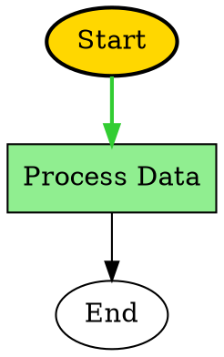

# 視覺化與實時高亮顯示

SemanticKernel.Graph 提供全面的視覺化功能，支援多格式匯出和實時執行高亮顯示。本參考涵蓋完整的視覺化生態系統，包括匯出格式、實時高亮顯示和執行覆蓋圖層。

## GraphVisualizationEngine

用於以多種格式生成視覺化的中央元件，具有進階樣式和自訂選項。

### 建構函式

```csharp
/// <summary>
/// Creates a new <see cref="GraphVisualizationEngine"/> with optional configuration
/// and an optional logger for diagnostics.
/// </summary>
/// <param name="options">Optional visualization options (null uses defaults).</param>
/// <param name="logger">Optional logger used to emit diagnostic messages.</param>
public GraphVisualizationEngine(GraphVisualizationOptions? options = null, IGraphLogger? logger = null)
{
    // Implementation note: if options is null, the engine should construct default options
    // to ensure predictable behavior. The logger is optional and may be null in tests.
}
```

**參數：**
* `options`: 視覺化配置選項
* `logger`: 用於診斷的記錄器實例

### 方法

#### Graph 結構序列化

```csharp
/// <summary>
/// Serializes the graph structure to DOT format for GraphViz rendering.
/// </summary>
/// <remarks>
/// The returned string is a complete DOT document. Use <see cref="DotSerializationOptions"/>
/// to control layout and styling.
/// </remarks>
public string SerializeToDot(GraphVisualizationData visualizationData, DotSerializationOptions? options = null)
{
    // Validate input and apply default options if necessary.
    // Implementation produces a DOT formatted string representing nodes and edges.
    throw new NotImplementedException();
}

/// <summary>
/// Serializes the graph structure to JSON format for API consumption.
/// </summary>
public string SerializeToJson(GraphVisualizationData visualizationData, JsonSerializationOptions? options = null)
{
    // Use a safe serializer with configured options (indentation, camelCase, depth limits).
    throw new NotImplementedException();
}

/// <summary>
/// Generates an enhanced Mermaid diagram with advanced styling and features.
/// </summary>
public string GenerateEnhancedMermaidDiagram(GraphVisualizationData visualizationData, MermaidGenerationOptions? options = null)
{
    // Convert graph structure into a Mermaid DSL string and apply any custom styles.
    throw new NotImplementedException();
}

/// <summary>
/// Serializes the graph structure to SVG format for web display.
/// </summary>
public string SerializeToSvg(GraphVisualizationData visualizationData, SvgSerializationOptions? options = null)
{
    // Produce an SVG string; consider performance for large graphs.
    throw new NotImplementedException();
}
```

**參數：**
* `visualizationData`: Graph 視覺化資料，包含節點、Edge 和執行狀態
* `options`: 格式特定的序列化選項

**回傳：** 所請求格式的已格式化字符串表示

### 支援的匯出格式

#### DOT 格式 (GraphViz)
專業級的 Graph 視覺化格式，用於 GraphViz 渲染，具有進階配置選項。

**功能：**
* 配置控制（從上到下、從左到右、從下到上、從右到左）
* Node 叢集和分組
* Node 和 Edge 的自訂樣式
* 執行路徑高亮顯示
* Node 類型資訊顯示

**範例輸出：**


#### JSON 格式
用於 API 使用、資料交換和程式化視覺化的結構化資料格式。

**功能：**
* Graph 結構的分層表示
* 中繼資料包含（時戳、執行指標、配置資訊）
* 用於網路和行動使用的 API 就緒格式
* 具有自訂屬性的可擴展結構
* 大型 Graph 的高效序列化

**範例輸出：**
```json
{
  "metadata": {
    "generatedAt": "2025-08-15T10:30:00Z",
    "nodeCount": 3,
    "edgeCount": 2,
    "hasExecutionPath": true,
    "currentNodeId": "process"
  },
  "nodes": [
    {
      "id": "start",
      "name": "Start",
      "type": "FunctionGraphNode",
      "isExecutable": true,
      "isCurrentNode": false,
      "isInExecutionPath": true
    }
  ],
  "edges": [
    {
      "from": "start",
      "to": "process",
      "label": "success",
      "type": "directed"
    }
  ],
  "executionPath": [
    {
      "nodeId": "start",
      "nodeName": "Start",
      "order": 0
    }
  ]
}
```

#### Mermaid 格式
對網路友善的圖表格式，具有進階樣式和實時高亮顯示支援。

**功能：**
* 多個配置方向（TB、LR、BT、RL）
* 具有 CSS 類別的進階樣式
* 執行路徑高亮顯示
* 基於 Node 類型的樣式
* 效能指示器
* 多個主題（預設、深色、森林、基本、中性）

**範例輸出：**
```mermaid
graph TD
    %% Graph generated at 2025-08-15 10:30:00
    
    start((Start))
    process[Process Data]
    end((End))
    
    start -->|success| process
    process -->|completed| end
    
    %% Real-time highlight styles
    classDef currentNode fill:#FFD700,stroke:#FF8C00,stroke-width:3px
    classDef executedNode fill:#90EE90,stroke:#32CD32,stroke-width:2px
    classDef pendingNode fill:#F0F0F0,stroke:#808080
    
    class process currentNode
    class start executedNode
```

#### SVG 格式
用於網路顯示和靜態影像生成的向量圖形格式。

**功能：**
* 可配置的畫布尺寸
* 可自訂的節點間距
* 指標覆蓋顯示
* 執行路徑高亮顯示
* 目前節點強調

## GraphRealtimeHighlighter

即時執行路徑追蹤，具有視覺高亮顯示和實時更新。

### 建構函式

```csharp
/// <summary>
/// Initializes a new instance of the <see cref="GraphRealtimeHighlighter"/>,
/// optionally subscribing to an execution event stream for automatic updates.
/// </summary>
/// <param name="eventStream">Optional source of execution events used to drive highlights.</param>
/// <param name="options">Optional configuration for highlighting behavior.</param>
/// <param name="logger">Optional logger for diagnostics.</param>
public GraphRealtimeHighlighter(
    IGraphExecutionEventStream? eventStream = null,
    GraphRealtimeHighlightOptions? options = null,
    IGraphLogger? logger = null)
{
    // Subscribe to eventStream if provided and apply options with sensible defaults.
}
```

**參數：**
* `eventStream`: 用於自動更新的選用事件流
* `options`: 高亮顯示配置選項
* `logger`: 用於診斷的記錄器實例

### 方法

#### 執行高亮顯示

```csharp
/// <summary>
/// Starts highlighting for a specific execution.
/// </summary>
public void StartHighlighting(string executionId, GraphVisualizationData visualizationData)
{
    // Guard clauses: validate executionId and visualizationData before proceeding.
}

/// <summary>
/// Updates the current node for an execution.
/// </summary>
public void UpdateCurrentNode(string executionId, IGraphNode currentNode, IReadOnlyList<IGraphNode> executionPath)
{
    // Update internal state and raise events to notify subscribers of the change.
}

/// <summary>
/// Adds completion highlight for a node.
/// </summary>
public void AddNodeCompletionHighlight(string executionId, IGraphNode node, bool success, TimeSpan executionTime)
{
    // Record completion metrics and update highlight styles accordingly.
}

/// <summary>
/// Stops highlighting for a specific execution.
/// </summary>
public void StopHighlighting(string executionId)
{
    // Clean up resources and unsubscribe from event streams related to this execution.
}
```

#### 高亮顯示視覺化生成

```csharp
/// <summary>
/// Generates a string representation of the highlighted visualization for the given
/// execution and format (Mermaid, JSON, DOT, SVG).
/// </summary>
public string GenerateHighlightedVisualization(string executionId, HighlightVisualizationFormat format)
{
    // Select formatter based on <paramref name="format"/> and return the generated string.
    throw new NotImplementedException();
}
```

**支援的格式：**
* `HighlightVisualizationFormat.Mermaid`: 具有高亮顯示的增強 Mermaid
* `HighlightVisualizationFormat.Json`: 具有執行狀態的 JSON
* `HighlightVisualizationFormat.Dot`: 具有執行路徑的 DOT
* `HighlightVisualizationFormat.Svg`: 具有實時覆蓋圖層的 SVG

#### 事件處理

```csharp
/// <summary>
/// Event raised when node highlighting changes. Subscribers should handle minimal work
/// and avoid blocking the caller; consider using a background queue for heavy work.
/// </summary>
public event EventHandler<NodeHighlightEventArgs>? NodeHighlightChanged;

/// <summary>
/// Event raised when execution path is updated.
/// </summary>
public event EventHandler<ExecutionPathUpdatedEventArgs>? ExecutionPathUpdated;
```

### 高亮顯示樣式

#### NodeHighlightStyle
```csharp
/// <summary>
/// Represents visual styling options applied to a node when highlighted.
/// All color values are expected to be valid CSS color strings (e.g. hex codes).
/// </summary>
public sealed class NodeHighlightStyle
{
    /// <summary>Fill color used for the node background.</summary>
    public string FillColor { get; set; } = "#FFFFFF";

    /// <summary>Stroke color used for the node border.</summary>
    public string StrokeColor { get; set; } = "#000000";

    /// <summary>Width of the stroke in pixels.</summary>
    public int StrokeWidth { get; set; } = 1;

    /// <summary>Opacity value between 0.0 (transparent) and 1.0 (opaque).</summary>
    public double Opacity { get; set; } = 1.0;

    /// <summary>Optional CSS border style (e.g. "dashed").</summary>
    public string? BorderStyle { get; set; }
}
```

#### EdgeHighlightStyle
```csharp
/// <summary>
/// Represents visual styling options applied to an edge when highlighted.
/// </summary>
public sealed class EdgeHighlightStyle
{
    /// <summary>Stroke color for the edge.</summary>
    public string StrokeColor { get; set; } = "#000000";

    /// <summary>Stroke width in pixels.</summary>
    public int StrokeWidth { get; set; } = 1;

    /// <summary>Opacity value between 0.0 and 1.0.</summary>
    public double Opacity { get; set; } = 1.0;
}
```

## 配置選項

### GraphVisualizationOptions

```csharp
/// <summary>
/// Global options used by <see cref="GraphVisualizationEngine"/> to control
/// theme, caching, and performance-related behavior.
/// </summary>
public sealed class GraphVisualizationOptions
{
    public VisualizationTheme Theme { get; set; } = VisualizationTheme.Default;
    public bool EnableRealtimeUpdates { get; set; } = true;
    public bool EnableCaching { get; set; } = true;
    public int MaxCacheSize { get; set; } = 100;
    public int CacheExpirationMinutes { get; set; } = 30;
    public bool IncludePerformanceMetrics { get; set; } = true;
    public int MaxNodesPerVisualization { get; set; } = 1000;
    public bool EnableAdvancedStyling { get; set; } = true;
}
```

### GraphRealtimeHighlightOptions

```csharp
/// <summary>
/// Options that control the behavior of real-time highlighting, including
/// update frequency and resource limits.
/// </summary>
public sealed class GraphRealtimeHighlightOptions
{
    /// <summary>If true, updates will be applied immediately without batching.</summary>
    public bool EnableImmediateUpdates { get; set; } = true;

    /// <summary>Interval used for batched updates when immediate updates are disabled.</summary>
    public TimeSpan UpdateInterval { get; set; } = TimeSpan.FromMilliseconds(100);

    public bool EnableAnimations { get; set; } = true;
    public bool EnablePerformanceTracking { get; set; } = true;

    /// <summary>Maximum number of nodes that can be highlighted at the same time.</summary>
    public int MaxHighlightedNodes { get; set; } = 100;
}
```

### 格式特定選項

#### DotSerializationOptions
```csharp
/// <summary>
/// Options to customize DOT serialization (GraphViz). Use <see cref="CustomNodeStyles"/>
/// and <see cref="CustomEdgeStyles"/> to inject additional style directives per type.
/// </summary>
public sealed class DotSerializationOptions
{
    public string GraphName { get; set; } = "SemanticKernelGraph";
    public bool EnableClustering { get; set; } = false;
    public bool HighlightExecutionPath { get; set; } = true;
    public bool HighlightCurrentNode { get; set; } = true;
    public DotLayoutDirection LayoutDirection { get; set; } = DotLayoutDirection.TopToBottom;
    public bool IncludeNodeTypeInfo { get; set; } = true;
    public Dictionary<string, string> CustomNodeStyles { get; set; } = new();
    public Dictionary<string, string> CustomEdgeStyles { get; set; } = new();
}
```

#### JsonSerializationOptions
```csharp
/// <summary>
/// Options controlling JSON serialization behavior used by the visualization APIs.
/// </summary>
public sealed class JsonSerializationOptions
{
    public bool Indented { get; set; } = true;
    public bool UseCamelCase { get; set; } = true;
    public bool IncludeNodeProperties { get; set; } = true;
    public bool IncludeLayoutInfo { get; set; } = true;
    public bool IncludeExecutionMetrics { get; set; } = false;
    public bool IncludeTimestamps { get; set; } = true;
    public int MaxSerializationDepth { get; set; } = 10;
}
```

#### MermaidGenerationOptions
```csharp
/// <summary>
/// Options for generating Mermaid diagrams. The <see cref="Direction"/> property
/// controls layout (e.g. "TD" for top-down).
/// </summary>
public sealed class MermaidGenerationOptions
{
    public string Direction { get; set; } = "TD";
    public bool IncludeTitle { get; set; } = true;
    public bool EnableStyling { get; set; } = true;
    public bool HighlightExecutionPath { get; set; } = true;
    public bool HighlightCurrentNode { get; set; } = true;
    public bool StyleByNodeType { get; set; } = true;
    public bool IncludePerformanceIndicators { get; set; } = false;
    public MermaidTheme Theme { get; set; } = MermaidTheme.Default;
    public Dictionary<string, string> CustomStyles { get; set; } = new();
}
```

#### SvgSerializationOptions
```csharp
/// <summary>
/// Options to control SVG output size and layout spacing used by the SVG serializer.
/// </summary>
public sealed class SvgSerializationOptions
{
    public int Width { get; set; } = 960;
    public int Height { get; set; } = 540;
    public int HorizontalSpacing { get; set; } = 180;
    public int VerticalSpacing { get; set; } = 120;
    public bool IncludeMetricsOverlay { get; set; } = true;
    public bool HighlightExecutionPath { get; set; } = true;
    public bool HighlightCurrentNode { get; set; } = true;
}
```

## 資料結構

### GraphVisualizationData

```csharp
/// <summary>
/// Immutable container representing the data required to render a graph visualization.
/// </summary>
public sealed class GraphVisualizationData
{
    /// <summary>List of nodes that compose the graph.</summary>
    public IReadOnlyList<IGraphNode> Nodes { get; }

    /// <summary>List of edges connecting nodes.</summary>
    public IReadOnlyList<GraphEdgeInfo> Edges { get; }

    /// <summary>The current node in execution, if any.</summary>
    public IGraphNode? CurrentNode { get; }

    /// <summary>Ordered list representing the execution path.</summary>
    public IReadOnlyList<IGraphNode> ExecutionPath { get; }

    /// <summary>Timestamp indicating when this visualization data was generated.</summary>
    public DateTimeOffset GeneratedAt { get; } = DateTimeOffset.UtcNow;
}
```

### GraphEdgeInfo

```csharp
/// <summary>
/// Lightweight representation of an edge used by the visualization system.
/// </summary>
public sealed class GraphEdgeInfo
{
    /// <summary>Source node identifier.</summary>
    public string FromNodeId { get; }

    /// <summary>Destination node identifier.</summary>
    public string ToNodeId { get; }

    /// <summary>Optional label for the edge (e.g. condition name).</summary>
    public string? Label { get; }

    /// <summary>Optional condition expression associated with this edge.</summary>
    public string? Condition { get; }

    /// <summary>Indicates whether this edge should be visually highlighted.</summary>
    public bool IsHighlighted { get; set; }
}
```

## 列舉

### HighlightVisualizationFormat
```csharp
/// <summary>
/// Supported formats for highlighted visualization exports.
/// </summary>
public enum HighlightVisualizationFormat
{
    Mermaid,    // Mermaid diagram format
    Json,       // JSON format
    Dot,        // DOT format for GraphViz
    Svg         // SVG format
}
```

### DotLayoutDirection
```csharp
/// <summary>
/// Layout directions used by DOT serializer.
/// </summary>
public enum DotLayoutDirection
{
    TopToBottom,    // TD - Top to bottom layout
    LeftToRight,    // LR - Left to right layout
    BottomToTop,    // BT - Bottom to top layout
    RightToLeft     // RL - Right to left layout
}
```

### VisualizationTheme
```csharp
public enum VisualizationTheme
{
    Default,        // Default theme
    Dark,           // Dark theme
    Light,          // Light theme
    HighContrast,   // High contrast theme for accessibility
    Professional,   // Professional theme for business presentations
    Colorful        // Colorful theme with vibrant colors
}
```

### MermaidTheme
```csharp
public enum MermaidTheme
{
    Default,    // Default Mermaid theme
    Dark,       // Dark theme
    Forest,     // Forest theme with green colors
    Base,       // Base theme with neutral colors
    Neutral     // Neutral theme
}
```

## 使用範例

### 基本視覺化設定

```csharp
using SemanticKernel.Graph.Core;

// Create visualization engine with options
var visualizationOptions = new GraphVisualizationOptions
{
    Theme = VisualizationTheme.Professional,
    EnableCaching = true,
    IncludePerformanceMetrics = true
};

var visualizationEngine = new GraphVisualizationEngine(visualizationOptions);

// Generate visualizations in different formats
var dotGraph = visualizationEngine.SerializeToDot(visualizationData);
var jsonGraph = visualizationEngine.SerializeToJson(visualizationData);
var mermaidDiagram = visualizationEngine.GenerateEnhancedMermaidDiagram(visualizationData);
```

### 實時高亮顯示設定

```csharp
using SemanticKernel.Graph.Core;

// Create real-time highlighter
var highlightOptions = new GraphRealtimeHighlightOptions
{
    UpdateInterval = TimeSpan.FromMilliseconds(100),
    EnableAnimations = true,
    EnablePerformanceTracking = true
};

var highlighter = new GraphRealtimeHighlighter(
    eventStream: executionEventStream,
    options: highlightOptions
);

// Start highlighting for an execution
highlighter.StartHighlighting(executionId, visualizationData);

// Update current execution state
highlighter.UpdateCurrentNode(executionId, currentNode, executionPath);

// Generate highlighted visualization
var highlightedMermaid = highlighter.GenerateHighlightedVisualization(
    executionId, 
    HighlightVisualizationFormat.Mermaid
);
```

### 自訂匯出選項

```csharp
// DOT export with custom styling
var dotOptions = new DotSerializationOptions
{
    GraphName = "My Workflow",
    LayoutDirection = DotLayoutDirection.LeftToRight,
    EnableClustering = true,
    HighlightExecutionPath = true,
    HighlightCurrentNode = true,
    CustomNodeStyles = new Dictionary<string, string>
    {
        ["FunctionGraphNode"] = "shape=box, style=filled, fillcolor=lightblue",
        ["ConditionalGraphNode"] = "shape=diamond, style=filled, fillcolor=lightyellow"
    }
};

var dotOutput = visualizationEngine.SerializeToDot(visualizationData, dotOptions);

// Mermaid export with custom theme
var mermaidOptions = new MermaidGenerationOptions
{
    Direction = "TB",
    IncludeTitle = true,
    EnableStyling = true,
    HighlightExecutionPath = true,
    Theme = MermaidTheme.Professional,
    CustomStyles = new Dictionary<string, string>
    {
        [".currentNode"] = "fill:#FFD700;stroke:#FF8C00;stroke-width:3px",
        [".executedNode"] = "fill:#90EE90;stroke:#32CD32;stroke-width:2px"
    }
};

var mermaidOutput = visualizationEngine.GenerateEnhancedMermaidDiagram(
    visualizationData, 
    mermaidOptions
);
```

## 效能考量

* **快取：** 啟用視覺化快取以進行重複匯出
* **批次更新：** 對實時高亮顯示使用適當的更新間隔
* **Node 限制：** 為大型 Graph 配置每個視覺化的最大節點數
* **記憶體管理：** 在不再需要時清除視覺化引擎
* **非同步作業：** 對大型 Graph 處理使用非同步方法

## 整合點

* **GraphInspectionApi**: 執行時檢查和視覺化資料生成
* **GraphMetricsExporter**: 效能指標與視覺化的整合
* **GraphDocumentationGenerator**: 自動生成包含視覺圖表的文檔
* **事件流：** 來自 Graph 執行事件的實時更新
* **偵錯工作階段：** 在偵錯和開發期間的視覺化

## 另請參閱

* [實時視覺化和高亮顯示](../how-to/real-time-visualization-and-highlights.md) - 實現實時視覺化指南
* [偵錯和檢查](../how-to/debug-and-inspection.md) - 使用視覺化進行偵錯
* [GraphVisualizationExample](../examples/graph-visualization-example.md) - 完整的範例實現
* [GraphInspectionApi](inspection-visualization.md) - 執行時檢查和視覺化 API
