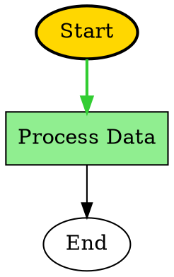

# 視覺化與即時高亮

SemanticKernel.Graph 提供全面的視覺化功能，支援多格式匯出和實時執行高亮。本參考涵蓋完整的視覺化生態系統，包括匯出格式、實時高亮和執行覆蓋。

## GraphVisualizationEngine

用於在多種格式中產生視覺化的中央元件，具有進階的樣式設定和自訂選項。

### 建構函式

```csharp
/// <summary>
/// 建立一個新的 <see cref="GraphVisualizationEngine"/>，包含可選的設定
/// 和可選的用於診斷的記錄器。
/// </summary>
/// <param name="options">可選的視覺化選項（null 使用預設值）。</param>
/// <param name="logger">可選的記錄器，用於發出診斷訊息。</param>
public GraphVisualizationEngine(GraphVisualizationOptions? options = null, IGraphLogger? logger = null)
{
    // 實作注意：如果 options 為 null，引擎應該建構預設選項
    // 以確保可預測的行為。記錄器是可選的，在測試中可能為 null。
}
```

**參數：**
* `options`：視覺化設定選項
* `logger`：用於診斷的記錄器實例

### 方法

#### 圖形結構序列化

```csharp
/// <summary>
/// 將圖形結構序列化為 DOT 格式以進行 GraphViz 渲染。
/// </summary>
/// <remarks>
/// 返回的字串是完整的 DOT 文件。使用 <see cref="DotSerializationOptions"/>
/// 來控制佈局和樣式設定。
/// </remarks>
public string SerializeToDot(GraphVisualizationData visualizationData, DotSerializationOptions? options = null)
{
    // 驗證輸入並在必要時應用預設選項。
    // 實作產生代表節點和邊的 DOT 格式字串。
    throw new NotImplementedException();
}

/// <summary>
/// 將圖形結構序列化為 JSON 格式以供 API 使用。
/// </summary>
public string SerializeToJson(GraphVisualizationData visualizationData, JsonSerializationOptions? options = null)
{
    // 使用安全的序列化器與已設定的選項（縮排、camelCase、深度限制）。
    throw new NotImplementedException();
}

/// <summary>
/// 產生具有進階樣式設定和功能的增強 Mermaid 圖表。
/// </summary>
public string GenerateEnhancedMermaidDiagram(GraphVisualizationData visualizationData, MermaidGenerationOptions? options = null)
{
    // 將圖形結構轉換為 Mermaid DSL 字串並應用任何自訂樣式。
    throw new NotImplementedException();
}

/// <summary>
/// 將圖形結構序列化為 SVG 格式以供網頁顯示。
/// </summary>
public string SerializeToSvg(GraphVisualizationData visualizationData, SvgSerializationOptions? options = null)
{
    // 產生 SVG 字串；考慮大型圖形的性能。
    throw new NotImplementedException();
}
```

**參數：**
* `visualizationData`：包含節點、邊和執行狀態的圖形視覺化資料
* `options`：特定於格式的序列化選項

**返回值：** 所要求格式的格式化字串表示

### 支援的匯出格式

#### DOT 格式（GraphViz）
用於 GraphViz 渲染的專業級圖形視覺化格式，具有進階的佈局選項。

**功能：**
* 佈局控制（上下、左右、下上、右左）
* 節點聚類和分組
* 節點和邊的自訂樣式設定
* 執行路徑高亮
* 節點類型資訊顯示

**範例輸出：**


#### JSON 格式
用於 API 使用、資料交換和程式化視覺化的結構化資料格式。

**功能：**
* 圖形結構的分層表示
* 後設資料包含（時間戳記、執行指標、佈局資訊）
* 適用於網頁和行動裝置使用的 API 格式
* 支援自訂屬性的可擴充結構
* 大型圖形的高效序列化

**範例輸出：**
```json
{
  "metadata": {
    "generatedAt": "2025-08-15T10:30:00Z",
    "nodeCount": 3,
    "edgeCount": 2,
    "hasExecutionPath": true,
    "currentNodeId": "process"
  },
  "nodes": [
    {
      "id": "start",
      "name": "Start",
      "type": "FunctionGraphNode",
      "isExecutable": true,
      "isCurrentNode": false,
      "isInExecutionPath": true
    }
  ],
  "edges": [
    {
      "from": "start",
      "to": "process",
      "label": "success",
      "type": "directed"
    }
  ],
  "executionPath": [
    {
      "nodeId": "start",
      "nodeName": "Start",
      "order": 0
    }
  ]
}
```

#### Mermaid 格式
網頁友善的圖表格式，支援進階樣式設定和實時高亮。

**功能：**
* 多個佈局方向（TB、LR、BT、RL）
* 使用 CSS 類別的進階樣式設定
* 執行路徑高亮
* 基於節點類型的樣式設定
* 性能指標
* 多個主題（預設、深色、森林、基礎、中立）

**範例輸出：**
```mermaid
graph TD
    %% Graph generated at 2025-08-15 10:30:00
    
    start((Start))
    process[Process Data]
    end((End))
    
    start -->|success| process
    process -->|completed| end
    
    %% Real-time highlight styles
    classDef currentNode fill:#FFD700,stroke:#FF8C00,stroke-width:3px
    classDef executedNode fill:#90EE90,stroke:#32CD32,stroke-width:2px
    classDef pendingNode fill:#F0F0F0,stroke:#808080
    
    class process currentNode
    class start executedNode
```

#### SVG 格式
用於網頁顯示和靜態圖像產生的向量圖形格式。

**功能：**
* 可設定的畫布尺寸
* 可自訂的節點間距
* 指標覆蓋顯示
* 執行路徑高亮
* 目前節點強調

## GraphRealtimeHighlighter

即時執行路徑追蹤，具有視覺高亮和實時更新。

### 建構函式

```csharp
/// <summary>
/// 初始化 <see cref="GraphRealtimeHighlighter"/> 的新實例，
/// 可選地訂閱執行事件串流以進行自動更新。
/// </summary>
/// <param name="eventStream">可選的執行事件來源，用於驅動高亮。</param>
/// <param name="options">可選的高亮行為設定。</param>
/// <param name="logger">可選的用於診斷的記錄器。</param>
public GraphRealtimeHighlighter(
    IGraphExecutionEventStream? eventStream = null,
    GraphRealtimeHighlightOptions? options = null,
    IGraphLogger? logger = null)
{
    // 訂閱提供的 eventStream 並應用選項與合理的預設值。
}
```

**參數：**
* `eventStream`：用於自動更新的可選事件串流
* `options`：高亮設定選項
* `logger`：用於診斷的記錄器實例

### 方法

#### 執行高亮

```csharp
/// <summary>
/// 開始針對特定執行的高亮。
/// </summary>
public void StartHighlighting(string executionId, GraphVisualizationData visualizationData)
{
    // 防衛子句：在繼續之前驗證 executionId 和 visualizationData。
}

/// <summary>
/// 更新執行的目前節點。
/// </summary>
public void UpdateCurrentNode(string executionId, IGraphNode currentNode, IReadOnlyList<IGraphNode> executionPath)
{
    // 更新內部狀態並引發事件以通知訂閱者變更。
}

/// <summary>
/// 為節點新增完成高亮。
/// </summary>
public void AddNodeCompletionHighlight(string executionId, IGraphNode node, bool success, TimeSpan executionTime)
{
    // 記錄完成指標並相應地更新高亮樣式。
}

/// <summary>
/// 停止針對特定執行的高亮。
/// </summary>
public void StopHighlighting(string executionId)
{
    // 清理資源並從與此執行相關的事件串流取消訂閱。
}
```

#### 高亮視覺化產生

```csharp
/// <summary>
/// 為給定的執行和格式（Mermaid、JSON、DOT、SVG）產生高亮視覺化的字串表示。
/// </summary>
public string GenerateHighlightedVisualization(string executionId, HighlightVisualizationFormat format)
{
    // 根據 <paramref name="format"/> 選擇格式化器並返回產生的字串。
    throw new NotImplementedException();
}
```

**支援的格式：**
* `HighlightVisualizationFormat.Mermaid`：具有高亮的增強 Mermaid
* `HighlightVisualizationFormat.Json`：具有執行狀態的 JSON
* `HighlightVisualizationFormat.Dot`：具有執行路徑的 DOT
* `HighlightVisualizationFormat.Svg`：具有實時覆蓋的 SVG

#### 事件處理

```csharp
/// <summary>
/// 節點高亮更改時引發的事件。訂閱者應該處理最少工作
/// 並避免阻止呼叫者；考慮為繁重工作使用背景佇列。
/// </summary>
public event EventHandler<NodeHighlightEventArgs>? NodeHighlightChanged;

/// <summary>
/// 執行路徑更新時引發的事件。
/// </summary>
public event EventHandler<ExecutionPathUpdatedEventArgs>? ExecutionPathUpdated;
```

### 高亮樣式

#### NodeHighlightStyle
```csharp
/// <summary>
/// 表示應用於高亮時節點的視覺樣式選項。
/// 所有色值應為有效的 CSS 色值字串（例如十六進位碼）。
/// </summary>
public sealed class NodeHighlightStyle
{
    /// <summary>用於節點背景的填充色。</summary>
    public string FillColor { get; set; } = "#FFFFFF";

    /// <summary>用於節點邊框的筆畫色。</summary>
    public string StrokeColor { get; set; } = "#000000";

    /// <summary>筆畫寬度（像素）。</summary>
    public int StrokeWidth { get; set; } = 1;

    /// <summary>不透明度值，介於 0.0（透明）和 1.0（不透明）之間。</summary>
    public double Opacity { get; set; } = 1.0;

    /// <summary>可選的 CSS 邊框樣式（例如「虛線」）。</summary>
    public string? BorderStyle { get; set; }
}
```

#### EdgeHighlightStyle
```csharp
/// <summary>
/// 表示應用於高亮時邊的視覺樣式選項。
/// </summary>
public sealed class EdgeHighlightStyle
{
    /// <summary>邊的筆畫色。</summary>
    public string StrokeColor { get; set; } = "#000000";

    /// <summary>筆畫寬度（像素）。</summary>
    public int StrokeWidth { get; set; } = 1;

    /// <summary>不透明度值，介於 0.0 和 1.0 之間。</summary>
    public double Opacity { get; set; } = 1.0;
}
```

## 設定選項

### GraphVisualizationOptions

```csharp
/// <summary>
/// 由 <see cref="GraphVisualizationEngine"/> 使用的全域選項，用於控制
/// 主題、快取和性能相關的行為。
/// </summary>
public sealed class GraphVisualizationOptions
{
    public VisualizationTheme Theme { get; set; } = VisualizationTheme.Default;
    public bool EnableRealtimeUpdates { get; set; } = true;
    public bool EnableCaching { get; set; } = true;
    public int MaxCacheSize { get; set; } = 100;
    public int CacheExpirationMinutes { get; set; } = 30;
    public bool IncludePerformanceMetrics { get; set; } = true;
    public int MaxNodesPerVisualization { get; set; } = 1000;
    public bool EnableAdvancedStyling { get; set; } = true;
}
```

### GraphRealtimeHighlightOptions

```csharp
/// <summary>
/// 控制實時高亮行為的選項，包括
/// 更新頻率和資源限制。
/// </summary>
public sealed class GraphRealtimeHighlightOptions
{
    /// <summary>如果為 true，更新將立即應用而不進行批次處理。</summary>
    public bool EnableImmediateUpdates { get; set; } = true;

    /// <summary>禁用立即更新時用於批次更新的間隔。</summary>
    public TimeSpan UpdateInterval { get; set; } = TimeSpan.FromMilliseconds(100);

    public bool EnableAnimations { get; set; } = true;
    public bool EnablePerformanceTracking { get; set; } = true;

    /// <summary>可同時高亮的最大節點數。</summary>
    public int MaxHighlightedNodes { get; set; } = 100;
}
```

### 特定於格式的選項

#### DotSerializationOptions
```csharp
/// <summary>
/// 用於自訂 DOT 序列化（GraphViz）的選項。使用 <see cref="CustomNodeStyles"/>
/// 和 <see cref="CustomEdgeStyles"/> 為每個類型注入額外的樣式指令。
/// </summary>
public sealed class DotSerializationOptions
{
    public string GraphName { get; set; } = "SemanticKernelGraph";
    public bool EnableClustering { get; set; } = false;
    public bool HighlightExecutionPath { get; set; } = true;
    public bool HighlightCurrentNode { get; set; } = true;
    public DotLayoutDirection LayoutDirection { get; set; } = DotLayoutDirection.TopToBottom;
    public bool IncludeNodeTypeInfo { get; set; } = true;
    public Dictionary<string, string> CustomNodeStyles { get; set; } = new();
    public Dictionary<string, string> CustomEdgeStyles { get; set; } = new();
}
```

#### JsonSerializationOptions
```csharp
/// <summary>
/// 控制視覺化 API 使用的 JSON 序列化行為的選項。
/// </summary>
public sealed class JsonSerializationOptions
{
    public bool Indented { get; set; } = true;
    public bool UseCamelCase { get; set; } = true;
    public bool IncludeNodeProperties { get; set; } = true;
    public bool IncludeLayoutInfo { get; set; } = true;
    public bool IncludeExecutionMetrics { get; set; } = false;
    public bool IncludeTimestamps { get; set; } = true;
    public int MaxSerializationDepth { get; set; } = 10;
}
```

#### MermaidGenerationOptions
```csharp
/// <summary>
/// 用於產生 Mermaid 圖表的選項。<see cref="Direction"/> 屬性
/// 控制佈局（例如「TD」表示上下）。
/// </summary>
public sealed class MermaidGenerationOptions
{
    public string Direction { get; set; } = "TD";
    public bool IncludeTitle { get; set; } = true;
    public bool EnableStyling { get; set; } = true;
    public bool HighlightExecutionPath { get; set; } = true;
    public bool HighlightCurrentNode { get; set; } = true;
    public bool StyleByNodeType { get; set; } = true;
    public bool IncludePerformanceIndicators { get; set; } = false;
    public MermaidTheme Theme { get; set; } = MermaidTheme.Default;
    public Dictionary<string, string> CustomStyles { get; set; } = new();
}
```

#### SvgSerializationOptions
```csharp
/// <summary>
/// 用於控制 SVG 輸出大小和佈局間距的選項，由 SVG 序列化器使用。
/// </summary>
public sealed class SvgSerializationOptions
{
    public int Width { get; set; } = 960;
    public int Height { get; set; } = 540;
    public int HorizontalSpacing { get; set; } = 180;
    public int VerticalSpacing { get; set; } = 120;
    public bool IncludeMetricsOverlay { get; set; } = true;
    public bool HighlightExecutionPath { get; set; } = true;
    public bool HighlightCurrentNode { get; set; } = true;
}
```

## 資料結構

### GraphVisualizationData

```csharp
/// <summary>
/// 不可變容器，表示渲染圖形視覺化所需的資料。
/// </summary>
public sealed class GraphVisualizationData
{
    /// <summary>組成圖形的節點列表。</summary>
    public IReadOnlyList<IGraphNode> Nodes { get; }

    /// <summary>連接節點的邊列表。</summary>
    public IReadOnlyList<GraphEdgeInfo> Edges { get; }

    /// <summary>執行中的目前節點（如果有）。</summary>
    public IGraphNode? CurrentNode { get; }

    /// <summary>表示執行路徑的有序列表。</summary>
    public IReadOnlyList<IGraphNode> ExecutionPath { get; }

    /// <summary>表示此視覺化資料產生時間的時間戳記。</summary>
    public DateTimeOffset GeneratedAt { get; } = DateTimeOffset.UtcNow;
}
```

### GraphEdgeInfo

```csharp
/// <summary>
/// 視覺化系統使用的邊的輕量級表示。
/// </summary>
public sealed class GraphEdgeInfo
{
    /// <summary>來源節點識別碼。</summary>
    public string FromNodeId { get; }

    /// <summary>目的節點識別碼。</summary>
    public string ToNodeId { get; }

    /// <summary>邊的可選標籤（例如條件名稱）。</summary>
    public string? Label { get; }

    /// <summary>與此邊相關聯的可選條件運算式。</summary>
    public string? Condition { get; }

    /// <summary>指示此邊是否應視覺化高亮。</summary>
    public bool IsHighlighted { get; set; }
}
```

## 列舉

### HighlightVisualizationFormat
```csharp
/// <summary>
/// 高亮視覺化匯出支援的格式。
/// </summary>
public enum HighlightVisualizationFormat
{
    Mermaid,    // Mermaid 圖表格式
    Json,       // JSON 格式
    Dot,        // 用於 GraphViz 的 DOT 格式
    Svg         // SVG 格式
}
```

### DotLayoutDirection
```csharp
/// <summary>
/// DOT 序列化器使用的佈局方向。
/// </summary>
public enum DotLayoutDirection
{
    TopToBottom,    // TD - 上下佈局
    LeftToRight,    // LR - 左右佈局
    BottomToTop,    // BT - 下上佈局
    RightToLeft     // RL - 右左佈局
}
```

### VisualizationTheme
```csharp
public enum VisualizationTheme
{
    Default,        // 預設主題
    Dark,           // 深色主題
    Light,          // 淺色主題
    HighContrast,   // 可訪問性高對比主題
    Professional,   // 用於商業演示的專業主題
    Colorful        // 具有鮮豔色彩的多彩主題
}
```

### MermaidTheme
```csharp
public enum MermaidTheme
{
    Default,    // 預設 Mermaid 主題
    Dark,       // 深色主題
    Forest,     // 具有綠色的森林主題
    Base,       // 具有中立色的基礎主題
    Neutral     // 中立主題
}
```

## 使用範例

### 基本視覺化設定

```csharp
using SemanticKernel.Graph.Core;

// 使用選項建立視覺化引擎
var visualizationOptions = new GraphVisualizationOptions
{
    Theme = VisualizationTheme.Professional,
    EnableCaching = true,
    IncludePerformanceMetrics = true
};

var visualizationEngine = new GraphVisualizationEngine(visualizationOptions);

// 以不同格式產生視覺化
var dotGraph = visualizationEngine.SerializeToDot(visualizationData);
var jsonGraph = visualizationEngine.SerializeToJson(visualizationData);
var mermaidDiagram = visualizationEngine.GenerateEnhancedMermaidDiagram(visualizationData);
```

### 實時高亮設定

```csharp
using SemanticKernel.Graph.Core;

// 建立實時高亮器
var highlightOptions = new GraphRealtimeHighlightOptions
{
    UpdateInterval = TimeSpan.FromMilliseconds(100),
    EnableAnimations = true,
    EnablePerformanceTracking = true
};

var highlighter = new GraphRealtimeHighlighter(
    eventStream: executionEventStream,
    options: highlightOptions
);

// 開始針對執行的高亮
highlighter.StartHighlighting(executionId, visualizationData);

// 更新目前執行狀態
highlighter.UpdateCurrentNode(executionId, currentNode, executionPath);

// 產生高亮視覺化
var highlightedMermaid = highlighter.GenerateHighlightedVisualization(
    executionId, 
    HighlightVisualizationFormat.Mermaid
);
```

### 自訂匯出選項

```csharp
// 具有自訂樣式的 DOT 匯出
var dotOptions = new DotSerializationOptions
{
    GraphName = "My Workflow",
    LayoutDirection = DotLayoutDirection.LeftToRight,
    EnableClustering = true,
    HighlightExecutionPath = true,
    HighlightCurrentNode = true,
    CustomNodeStyles = new Dictionary<string, string>
    {
        ["FunctionGraphNode"] = "shape=box, style=filled, fillcolor=lightblue",
        ["ConditionalGraphNode"] = "shape=diamond, style=filled, fillcolor=lightyellow"
    }
};

var dotOutput = visualizationEngine.SerializeToDot(visualizationData, dotOptions);

// 具有自訂主題的 Mermaid 匯出
var mermaidOptions = new MermaidGenerationOptions
{
    Direction = "TB",
    IncludeTitle = true,
    EnableStyling = true,
    HighlightExecutionPath = true,
    Theme = MermaidTheme.Professional,
    CustomStyles = new Dictionary<string, string>
    {
        [".currentNode"] = "fill:#FFD700;stroke:#FF8C00;stroke-width:3px",
        [".executedNode"] = "fill:#90EE90;stroke:#32CD32;stroke-width:2px"
    }
};

var mermaidOutput = visualizationEngine.GenerateEnhancedMermaidDiagram(
    visualizationData, 
    mermaidOptions
);
```

## 性能考量

* **快取**：為重複匯出啟用視覺化快取
* **批次更新**：為實時高亮使用適當的更新間隔
* **節點限制**：為大型圖形配置每個視覺化的最大節點數
* **記憶體管理**：在不再需要時配置視覺化引擎
* **非同步操作**：為大型圖形處理使用非同步方法

## 整合點

* **GraphInspectionApi**：執行時檢檢查和視覺化資料產生
* **GraphMetricsExporter**：與視覺化整合的性能指標
* **GraphDocumentationGenerator**：使用視覺圖表的自動文件
* **事件串流**：來自圖形執行事件的實時更新
* **偵錯工作階段**：在偵錯和開發期間的視覺化

## 另請參閱

* [實時視覺化與高亮](../how-to/real-time-visualization-and-highlights.md) - 實施實時視覺化指南
* [偵錯與檢查](../how-to/debug-and-inspection.md) - 使用視覺化進行偵錯
* [GraphVisualizationExample](../examples/graph-visualization-example.md) - 完整的實作範例
* [GraphInspectionApi](inspection-visualization.md) - 執行時檢查和視覺化 API
