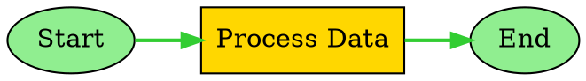

# 即時視覺化與高亮顯示

SemanticKernel.Graph 提供全面的即時視覺化功能，包括執行路徑高亮顯示、多格式匯出支援以及即時執行覆蓋層。本指南涵蓋了完整的視覺化生態系統，包括即時高亮顯示、匯出格式和執行監控。

## 概述

即時視覺化系統由幾個關鍵元件組成：

* **GraphVisualizationEngine**：多格式匯出引擎，支援 DOT、JSON、Mermaid 和 SVG
* **GraphRealtimeHighlighter**：具有視覺高亮顯示的即時執行路徑追蹤
* **Export Formats**：適用於各種視覺化工具的專業級輸出
* **Execution Overlays**：即時高亮顯示當前執行狀態
* **Customizable Themes**：多個視覺主題和樣式選項

## 核心元件

### GraphVisualizationEngine

`GraphVisualizationEngine` 是用於以多種格式生成視覺化的中央元件，具有進階的樣式和自訂選項。

```csharp
public sealed class GraphVisualizationEngine : IDisposable
{
    /// <summary>
    /// 將 Graph 結構序列化為 DOT 格式以供 GraphViz 渲染。
    /// </summary>
    public string SerializeToDot(GraphVisualizationData visualizationData, DotSerializationOptions? options = null);
    
    /// <summary>
    /// 將 Graph 結構序列化為 JSON 格式以供 API 使用。
    /// </summary>
    public string SerializeToJson(GraphVisualizationData visualizationData, JsonSerializationOptions? options = null);
    
    /// <summary>
    /// 使用進階樣式和功能生成增強的 Mermaid 圖表。
    /// </summary>
    public string GenerateEnhancedMermaidDiagram(GraphVisualizationData visualizationData, MermaidGenerationOptions? options = null);
}
```

**主要功能：**
* **多格式支援**：DOT、JSON、Mermaid 和 SVG 匯出
* **進階樣式**：可自訂主題和視覺元素
* **效能指標**：與執行指標的整合
* **即時更新**：支援即時執行高亮顯示
* **專業輸出**：可用於生產環境的視覺化格式

**使用範例：**
```csharp
// 使用明確的選項建立引擎。在 docs/examples 中有完整的可執行演示位於
// `examples/GraphVisualizationExample.cs`，展示端到端的使用方式。
var visualizationOptions = new GraphVisualizationOptions
{
    EnableRealtimeUpdates = true,
    IncludePerformanceMetrics = true,
    EnableAdvancedStyling = true
};

using var visualizationEngine = new GraphVisualizationEngine(visualizationOptions);

// 建立一個最小的 Graph：兩個函式 Node 由一個 Edge 連接
var fn1 = KernelFunctionFactory.CreateFromMethod(() => "node1-output", "Fn1");
var fn2 = KernelFunctionFactory.CreateFromMethod(() => "node2-output", "Fn2");

var node1 = new FunctionGraphNode(fn1, "node1", "Start");
var node2 = new FunctionGraphNode(fn2, "node2", "Process");

var nodes = new List<IGraphNode> { node1, node2 };
var edges = new List<GraphEdgeInfo> { new GraphEdgeInfo("node1", "node2", "on_success") };

var executionPath = new List<IGraphNode> { node1, node2 };
var visualizationData = new GraphVisualizationData(nodes, edges, currentNode: node2, executionPath: executionPath);

// 匯出為不同格式（字串可以儲存到檔案或從 API 返回）
var dotGraph = visualizationEngine.SerializeToDot(visualizationData);
var jsonGraph = visualizationEngine.SerializeToJson(visualizationData);
var mermaidDiagram = visualizationEngine.GenerateEnhancedMermaidDiagram(visualizationData);
```

### GraphRealtimeHighlighter

`GraphRealtimeHighlighter` 提供具有視覺高亮顯示、串流更新以及可自訂高亮樣式的即時執行追蹤。

```csharp
public sealed class GraphRealtimeHighlighter : IDisposable
{
    /// <summary>
    /// 開始 Graph 執行的高亮顯示。
    /// </summary>
    public void StartHighlighting(string executionId, GraphVisualizationData initialVisualizationData, ExecutionHighlightStyle? highlightStyle = null);
    
    /// <summary>
    /// 更新正在執行的當前 Node。
    /// </summary>
    public void UpdateCurrentNode(string executionId, IGraphNode currentNode, IReadOnlyList<IGraphNode> executionPath);
    
    /// <summary>
    /// 以指定的格式生成高亮顯示的視覺化。
    /// </summary>
    public string GenerateHighlightedVisualization(string executionId, HighlightVisualizationFormat format);
}
```

**主要功能：**
* **即時追蹤**：執行進度的即時更新
* **視覺高亮顯示**：當前和已完成 Node 的可自訂樣式
* **串流支援**：為網頁/行動設備使用做準備
* **效能最佳化**：高頻執行的批次更新
* **多訂閱者**：支援多個視覺化使用者

**使用範例：**
```csharp
// 建立一個可以從您的執行串流接受事件或手動驅動的高亮器。
var highlightOptions = new GraphRealtimeHighlightOptions
{
    UpdateInterval = TimeSpan.FromMilliseconds(100),
    EnableAnimations = true
};

using var highlighter = new GraphRealtimeHighlighter(eventStream: null, options: highlightOptions);

// 使用現有的 GraphVisualizationData 實例開始新執行的高亮顯示。
highlighter.StartHighlighting(executionId, visualizationData);

// 訂閱事件（處理程式應該輕量級；將繁重工作卸載）
highlighter.NodeExecutionStarted += (sender, e) =>
{
    // 記錄或將更新推送到 UI/WebSocket
    Console.WriteLine($"Node {e.Node.NodeId} started in execution {e.ExecutionId}");
};

highlighter.NodeExecutionCompleted += (sender, e) =>
{
    Console.WriteLine($"Node {e.Node.NodeId} completed in execution {e.ExecutionId} (success={e.Success})");
};

// 在執行期間手動更新當前 Node 和路徑
highlighter.UpdateCurrentNode(executionId, currentNode, executionPath);

// 生成高亮顯示的 Mermaid 圖表以嵌入文檔或 UI
var highlightedMermaid = highlighter.GenerateHighlightedVisualization(executionId, HighlightVisualizationFormat.Mermaid);
```

## 匯出格式

### DOT 格式（GraphViz）

用於 GraphViz 渲染的專業級 Graph 視覺化格式，具有進階的配置選項。

```csharp
var dotOptions = new DotSerializationOptions
{
    GraphName = "My Workflow",
    LayoutDirection = DotLayoutDirection.LeftToRight,
    EnableClustering = true,
    HighlightExecutionPath = true,
    HighlightCurrentNode = true,
    IncludeNodeTypeInfo = true
};

var dotGraph = visualizationEngine.SerializeToDot(visualizationData, dotOptions);
```

**DOT 格式功能：**
* **配置控制**：自上而下、由左至右等多個方向
* **Node 聚合**：相關 Node 的自動分組
* **自訂樣式**：使用者定義的 Node 和 Edge 樣式
* **執行高亮顯示**：執行路徑上的視覺強調
* **專業輸出**：業界標準的 GraphViz 格式

**生成的 DOT 範例：**


### JSON 格式

適用於 API 使用、資料交換和程式設計視覺化的結構化資料格式。

```csharp
var jsonOptions = new JsonSerializationOptions
{
    Indented = true,
    UseCamelCase = true,
    IncludeNodeProperties = true,
    IncludeLayoutInfo = true,
    IncludeExecutionMetrics = true,
    IncludeTimestamps = true
};

var jsonGraph = visualizationEngine.SerializeToJson(visualizationData, jsonOptions);
```

**JSON 格式功能：**
* **結構化資料**：Graph 結構的階層式表示
* **中繼資料包含**：時間戳記、執行指標和配置資訊
* **API 就緒**：最佳化以供網頁和行動設備使用
* **可擴充性**：輕鬆擴充自訂屬性
* **效能**：大型 Graph 的有效序列化

**生成的 JSON 範例：**
```json
{
  "metadata": {
    "generatedAt": "2025-08-15T10:30:00Z",
    "nodeCount": 3,
    "edgeCount": 2,
    "hasExecutionPath": true
  },
  "nodes": [
    {
      "nodeId": "start",
      "name": "Start",
      "type": "FunctionGraphNode",
      "position": { "x": 100, "y": 200 }
    }
  ],
  "edges": [
    {
      "sourceId": "start",
      "targetId": "process",
      "condition": null
    }
  ],
  "executionPath": ["start", "process"],
  "currentNode": "process"
}
```

### Mermaid 格式

網頁友善的圖表格式，具有增強的樣式和即時高亮顯示支援。

```csharp
var mermaidOptions = new MermaidGenerationOptions
{
    Direction = "TB", // 由上到下
    IncludeTitle = true,
    EnableStyling = true,
    StyleByNodeType = true,
    HighlightExecutionPath = true,
    HighlightCurrentNode = true,
    Theme = MermaidTheme.Default
};

var mermaidDiagram = visualizationEngine.GenerateEnhancedMermaidDiagram(visualizationData, mermaidOptions);
```

**Mermaid 格式功能：**
* **網頁整合**：Markdown 和文檔中的原生支援
* **增強樣式**：自訂主題和視覺自訂
* **即時高亮顯示**：執行路徑強調的即時展示
* **可存取性**：高對比和專業主題
* **互動式**：支援點擊事件和工具提示

**生成的 Mermaid 範例：**
```mermaid
graph TB
    %% Graph 生成於 2025-08-15 10:30:00
    
    start((Start))
    process[Process Data]
    end((End))
    
    start --> process
    process --> end
    
    %% 即時高亮顯示樣式
    classDef currentNode fill:#FFD700,stroke:#FF6347,stroke-width:3
    classDef completedNode fill:#90EE90,stroke:#228B22,stroke-width:2
    classDef executionPath stroke:#32CD32,stroke-width:2
    
    class process currentNode
    class start completedNode
    class start,process executionPath
```

### SVG 格式

具有可自訂樣式和即時執行覆蓋層的向量圖形格式。

```csharp
var svgOptions = new SvgSerializationOptions
{
    Width = 1200,
    Height = 800,
    HorizontalSpacing = 200,
    VerticalSpacing = 150,
    IncludeMetricsOverlay = true,
    HighlightExecutionPath = true,
    HighlightCurrentNode = true
};

var svgGraph = visualizationEngine.SerializeToSvg(visualizationData, svgOptions);
```

**SVG 格式功能：**
* **向量圖形**：無品質損失的可擴充性
* **可自訂尺寸**：可配置的畫布大小和間距
* **指標覆蓋層**：內建的效能指標
* **執行高亮顯示**：路徑和 Node 強調的即時展示
* **網頁整合**：原生瀏覽器支援

## 即時執行覆蓋層

### 執行高亮顯示

即時高亮顯示在 Graph 執行期間提供即時視覺回饋。

```csharp
// 配置高亮樣式
var highlightStyle = new ExecutionHighlightStyle
{
    CurrentNodeStyle = new NodeHighlightStyle
    {
        FillColor = "#FFD700",      // 金色
        StrokeColor = "#FF6347",    // 番茄色
        StrokeWidth = 3
    },
    CompletedNodeStyle = new NodeHighlightStyle
    {
        FillColor = "#90EE90",      // 淺綠色
        StrokeColor = "#228B22",    // 森林綠
        StrokeWidth = 2
    },
    FailedNodeStyle = new NodeHighlightStyle
    {
        FillColor = "#FFB6C1",      // 淺粉紅色
        StrokeColor = "#DC143C",    // 深紅色
        StrokeWidth = 2
    },
    ExecutionPathStyle = new EdgeHighlightStyle
    {
        StrokeColor = "#32CD32",    // 淺綠色
        StrokeWidth = 2
    }
};

// 使用自訂樣式開始高亮顯示
highlighter.StartHighlighting(executionId, visualizationData, highlightStyle);
```

### 即時更新

高亮器通過事件和串流提供即時更新。

```csharp
// 訂閱高亮事件
highlighter.NodeExecutionStarted += (sender, e) =>
{
    Console.WriteLine($"Node {e.Node.Name} started execution");
};

highlighter.NodeExecutionCompleted += (sender, e) =>
{
    Console.WriteLine($"Node {e.Node.Name} completed execution");
};

highlighter.ExecutionPathUpdated += (sender, e) =>
{
    Console.WriteLine($"Execution path updated: {e.ExecutionPath.Count} nodes");
};

// 更新執行狀態
highlighter.UpdateCurrentNode(executionId, currentNode, executionPath);
highlighter.UpdateExecutionPath(executionId, newExecutionPath);
```

### 效能監控

與效能指標的整合，以進行全面的執行監控。

```csharp
// 新增包含效能資料的 Node 完成
highlighter.AddNodeCompletionHighlight(
    executionId,
    completedNode,
    success: true,
    executionTime: TimeSpan.FromMilliseconds(150)
);

// 生成效能增強的視覺化
var performanceData = new
{
    executionId,
    totalNodes = executionPath.Count,
    completedNodes = completedNodes.Count,
    averageExecutionTime = completedNodes.Values.Average(n => n.ExecutionTime.TotalMilliseconds),
    successRate = completedNodes.Values.Count(n => n.Success) / (double)completedNodes.Count
};
```

## 配置選項

### GraphVisualizationOptions

視覺化引擎的全域配置。

```csharp
var visualizationOptions = new GraphVisualizationOptions
{
    Theme = VisualizationTheme.Professional,
    EnableRealtimeUpdates = true,
    EnableCaching = true,
    MaxCacheSize = 200,
    CacheExpirationMinutes = 60,
    IncludePerformanceMetrics = true,
    MaxNodesPerVisualization = 2000,
    EnableAdvancedStyling = true
};
```

### GraphRealtimeHighlightOptions

即時高亮顯示行為的配置。

```csharp
var highlightOptions = new GraphRealtimeHighlightOptions
{
    UpdateInterval = TimeSpan.FromMilliseconds(50),
    EnableImmediateUpdates = false,
    MaxHistorySnapshots = 2000,
    EnableAnimations = true,
    MaxConcurrentExecutions = 100,
    DefaultHighlightStyle = new ExecutionHighlightStyle()
};
```

## 進階功能

### 自訂主題

為不同的使用案例建立自訂視覺主題。

```csharp
// 用於商務簡報的專業主題
var professionalTheme = new VisualizationTheme
{
    PrimaryColor = "#2E86AB",
    SecondaryColor = "#A23B72",
    BackgroundColor = "#F8F9FA",
    TextColor = "#212529",
    AccentColor = "#F7931E"
};

// 用於可存取性的高對比主題
var highContrastTheme = new VisualizationTheme
{
    PrimaryColor = "#000000",
    SecondaryColor = "#FFFFFF",
    BackgroundColor = "#FFFFFF",
    TextColor = "#000000",
    AccentColor = "#FF0000"
};
```

### Node 類型樣式

基於 Node 類型和執行狀態的自動樣式。

```csharp
var mermaidOptions = new MermaidGenerationOptions
{
    StyleByNodeType = true,
    CustomNodeStyles = new Dictionary<string, string>
    {
        ["FunctionGraphNode"] = "fill:#E3F2FD,stroke:#1976D2",
        ["ConditionalGraphNode"] = "fill:#FFF3E0,stroke:#F57C00",
        ["ReActLoopGraphNode"] = "fill:#F3E5F5,stroke:#7B1FA2"
    }
};
```

### 匯出管線

適用於多種格式的自動化匯出管線。

```csharp
public async Task ExportAllFormatsAsync(GraphVisualizationData data, string baseFileName)
{
    var tasks = new List<Task>();
    
    // 匯出為 DOT
    tasks.Add(File.WriteAllTextAsync($"{baseFileName}.dot", 
        visualizationEngine.SerializeToDot(data)));
    
    // 匯出為 JSON
    tasks.Add(File.WriteAllTextAsync($"{baseFileName}.json", 
        visualizationEngine.SerializeToJson(data)));
    
    // 匯出為 Mermaid
    tasks.Add(File.WriteAllTextAsync($"{baseFileName}.mermaid", 
        visualizationEngine.GenerateEnhancedMermaidDiagram(data)));
    
    // 匯出為 SVG
    tasks.Add(File.WriteAllTextAsync($"{baseFileName}.svg", 
        visualizationEngine.SerializeToSvg(data)));
    
    await Task.WhenAll(tasks);
}
```

## 整合模式

### 網頁應用程式整合

將即時視覺化與網頁應用程式整合。

```csharp
// WebSocket 端點用於即時更新
app.MapHub<VisualizationHub>("/visualization");

// 用於靜態匯出的 REST API
app.MapGet("/api/visualization/{executionId}/dot", (string executionId) =>
{
    var visualizationData = GetVisualizationData(executionId);
    return visualizationEngine.SerializeToDot(visualizationData);
});

app.MapGet("/api/visualization/{executionId}/mermaid", (string executionId) =>
{
    var visualizationData = GetVisualizationData(executionId);
    return visualizationEngine.GenerateEnhancedMermaidDiagram(visualizationData);
});
```

### 文檔生成

具有嵌入式視覺化的自動化文檔。

```csharp
var documentationGenerator = new GraphDocumentationGenerator(
    new GraphDocumentationOptions
    {
        IncludeMermaidDiagram = true,
        IncludeJsonGraph = true,
        IncludeDotGraph = true,
        IncludePerformanceAnalysis = true
    }
);

var documentation = documentationGenerator.GenerateDocumentation(visualizationData);
await File.WriteAllTextAsync("graph_documentation.md", documentation);
```

### 監控儀表板

具有即時更新的即時監控儀表板。

```csharp
// 建立監控儀表板
var dashboard = new VisualizationDashboard(
    visualizationEngine,
    realtimeHighlighter,
    performanceMetrics
);

// 訂閱執行事件
dashboard.ExecutionStarted += (sender, e) =>
{
    // 使用新執行更新儀表板
    dashboard.AddExecution(e.ExecutionId, e.VisualizationData);
};

dashboard.ExecutionUpdated += (sender, e) =>
{
    // 使用當前狀態重新整理儀表板
    dashboard.UpdateExecution(e.ExecutionId, e.HighlightState);
};
```

## 最佳實踐

### 效能最佳化

1. **啟用快取**：對重複匯出使用視覺化快取
2. **批次更新**：為即時高亮顯示配置適當的更新間隔
3. **限制 Node 數量**：為大型 Graph 設定合理的限制
4. **非同步操作**：對大型視覺化使用非同步匯出方法

### 視覺設計

1. **一致的主題**：在所有視覺化中使用一致的配色方案
2. **可存取性**：提供高對比主題以改善可見性
3. **專業外觀**：對商務簡報使用專業主題
4. **自訂樣式**：利用自訂 Node 和 Edge 樣式來提高清晰度

### 即時更新

1. **更新頻率**：平衡更新頻率與效能
2. **事件處理**：正確處理和釋放事件訂閱
3. **錯誤處理**：為視覺化失敗實現健全的錯誤處理
4. **資源管理**：正確釋放視覺化元件

## 故障排除

### 常見問題

**視覺化未更新**
* 檢查是否啟用了即時更新
* 驗證事件串流連線
* 確保正確釋放元件

**匯出格式問題**
* 驗證輸入資料結構
* 檢查格式特定選項
* 驗證匯出的檔案權限

**效能問題**
* 降低更新頻率
* 啟用快取
* 限制並行視覺化

### 偵錯提示

1. **啟用詳細記錄**：將記錄層級設定為 Debug 以取得視覺化詳細資訊
2. **檢查事件訂閱**：驗證事件處理程式已正確連接
3. **監控資源使用**：在視覺化期間追蹤記憶體和 CPU 使用情況
4. **使用小型 Graph 測試**：從簡單 Graph 開始驗證功能

## 概念和技巧

**即時視覺化**：在執行期間對 Graph 視覺化進行即時更新，包含當前狀態高亮顯示。

**執行覆蓋層**：對執行路徑、當前 Node 和完成狀態的視覺強調，即時進行。

**多格式匯出**：支援多種視覺化格式（DOT、JSON、Mermaid、SVG）以適應不同的使用案例。

**高亮樣式**：針對不同執行狀態和 Node 類型的可自訂視覺樣式。

**串流更新**：適用於跨多個使用者的即時視覺化更新的即時資料流。

## 另請參閱

* [偵錯與檢查](debug-and-inspection.md) - 偵錯視覺化和檢查功能
* [Graph 檢查 API](graph-inspection-api.md) - 執行時 Graph 檢查和監控
* [效能指標](metrics-and-observability.md) - 與效能監控的整合
* [串流執行](streaming-execution.md) - 即時執行事件串流
