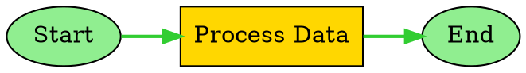

# 即時視覺化與亮點展示

SemanticKernel.Graph 提供全面的即時視覺化能力，包括執行路徑亮點標示、多格式匯出支援，以及實時執行覆蓋層。本指南涵蓋完整的視覺化生態系統，包括即時亮點標示、匯出格式和執行監控。

## 概述

即時視覺化系統由多個關鍵元件組成：

* **GraphVisualizationEngine**：支援 DOT、JSON、Mermaid 和 SVG 的多格式匯出引擎
* **GraphRealtimeHighlighter**：具有視覺亮點標示的實時執行路徑追蹤
* **匯出格式**：適用於各種視覺化工具的專業級輸出
* **執行覆蓋層**：目前執行狀態的即時亮點展示
* **可自訂主題**：多種視覺主題和樣式選項

## 核心元件

### GraphVisualizationEngine

`GraphVisualizationEngine` 是用於以多種格式生成視覺化的中央元件，具有進階樣式設定和自訂選項。

```csharp
public sealed class GraphVisualizationEngine : IDisposable
{
    /// <summary>
    /// 將圖形結構序列化為 DOT 格式以供 GraphViz 渲染。
    /// </summary>
    public string SerializeToDot(GraphVisualizationData visualizationData, DotSerializationOptions? options = null);
    
    /// <summary>
    /// 將圖形結構序列化為 JSON 格式以供 API 消費。
    /// </summary>
    public string SerializeToJson(GraphVisualizationData visualizationData, JsonSerializationOptions? options = null);
    
    /// <summary>
    /// 產生具有進階樣式和功能的增強 Mermaid 圖表。
    /// </summary>
    public string GenerateEnhancedMermaidDiagram(GraphVisualizationData visualizationData, MermaidGenerationOptions? options = null);
}
```

**主要功能：**
* **多格式支援**：DOT、JSON、Mermaid 和 SVG 匯出
* **進階樣式設定**：可自訂的主題和視覺元素
* **效能指標**：與執行指標的整合
* **即時更新**：支援實時執行亮點標示
* **專業輸出**：生產就緒的視覺化格式

**使用範例：**
```csharp
// 使用明確選項建立引擎。在文件/範例中，完整可執行的示範位於
// `examples/GraphVisualizationExample.cs`，展示端到端的使用方式。
var visualizationOptions = new GraphVisualizationOptions
{
    EnableRealtimeUpdates = true,
    IncludePerformanceMetrics = true,
    EnableAdvancedStyling = true
};

using var visualizationEngine = new GraphVisualizationEngine(visualizationOptions);

// 建立最小化圖形：兩個函數節點通過邊連接
var fn1 = KernelFunctionFactory.CreateFromMethod(() => "node1-output", "Fn1");
var fn2 = KernelFunctionFactory.CreateFromMethod(() => "node2-output", "Fn2");

var node1 = new FunctionGraphNode(fn1, "node1", "Start");
var node2 = new FunctionGraphNode(fn2, "node2", "Process");

var nodes = new List<IGraphNode> { node1, node2 };
var edges = new List<GraphEdgeInfo> { new GraphEdgeInfo("node1", "node2", "on_success") };

var executionPath = new List<IGraphNode> { node1, node2 };
var visualizationData = new GraphVisualizationData(nodes, edges, currentNode: node2, executionPath: executionPath);

// 匯出到不同格式（字串可保存為檔案或從 API 傳回）
var dotGraph = visualizationEngine.SerializeToDot(visualizationData);
var jsonGraph = visualizationEngine.SerializeToJson(visualizationData);
var mermaidDiagram = visualizationEngine.GenerateEnhancedMermaidDiagram(visualizationData);
```

### GraphRealtimeHighlighter

`GraphRealtimeHighlighter` 提供具有視覺亮點標示、串流更新和可自訂亮點樣式的實時執行追蹤。

```csharp
public sealed class GraphRealtimeHighlighter : IDisposable
{
    /// <summary>
    /// 開始為圖形執行進行亮點標示。
    /// </summary>
    public void StartHighlighting(string executionId, GraphVisualizationData initialVisualizationData, ExecutionHighlightStyle? highlightStyle = null);
    
    /// <summary>
    /// 更新目前正在執行的節點。
    /// </summary>
    public void UpdateCurrentNode(string executionId, IGraphNode currentNode, IReadOnlyList<IGraphNode> executionPath);
    
    /// <summary>
    /// 以指定格式產生亮點標示的視覺化。
    /// </summary>
    public string GenerateHighlightedVisualization(string executionId, HighlightVisualizationFormat format);
}
```

**主要功能：**
* **即時追蹤**：執行進度的即時更新
* **視覺亮點標示**：目前和已完成節點的可自訂樣式
* **串流支援**：準備好供網頁/行動消費
* **效能最佳化**：用於高頻執行的批量更新
* **多訂閱者**：支援多個視覺化消費者

**使用範例：**
```csharp
// 建立可接受事件的亮點標示工具，或手動驅動。
var highlightOptions = new GraphRealtimeHighlightOptions
{
    UpdateInterval = TimeSpan.FromMilliseconds(100),
    EnableAnimations = true
};

using var highlighter = new GraphRealtimeHighlighter(eventStream: null, options: highlightOptions);

// 使用現有的 GraphVisualizationData 執行個體為新執行開始亮點標示。
highlighter.StartHighlighting(executionId, visualizationData);

// 訂閱事件（處理程式應輕量；卸載繁重工作）
highlighter.NodeExecutionStarted += (sender, e) =>
{
    // 記錄或將更新推送到 UI/WebSocket
    Console.WriteLine($"Node {e.Node.NodeId} started in execution {e.ExecutionId}");
};

highlighter.NodeExecutionCompleted += (sender, e) =>
{
    Console.WriteLine($"Node {e.Node.NodeId} completed in execution {e.ExecutionId} (success={e.Success})");
};

// 在執行期間手動更新目前節點和路徑
highlighter.UpdateCurrentNode(executionId, currentNode, executionPath);

// 產生亮點標示的 Mermaid 圖表以嵌入文件或 UI
var highlightedMermaid = highlighter.GenerateHighlightedVisualization(executionId, HighlightVisualizationFormat.Mermaid);
```

## 匯出格式

### DOT 格式 (GraphViz)

專業級圖形視覺化格式，用於 GraphViz 渲染，提供進階版面配置選項。

```csharp
var dotOptions = new DotSerializationOptions
{
    GraphName = "My Workflow",
    LayoutDirection = DotLayoutDirection.LeftToRight,
    EnableClustering = true,
    HighlightExecutionPath = true,
    HighlightCurrentNode = true,
    IncludeNodeTypeInfo = true
};

var dotGraph = visualizationEngine.SerializeToDot(visualizationData, dotOptions);
```

**DOT 格式功能：**
* **版面配置控制**：由上到下、由左到右等各種方向
* **節點叢集**：相關節點的自動分組
* **自訂樣式**：使用者定義的節點和邊樣式
* **執行亮點標示**：執行路徑的視覺強調
* **專業輸出**：業界標準 GraphViz 格式

**產生的 DOT 範例：**


### JSON 格式

用於 API 消費、資料交換和程式設計視覺化的結構化資料格式。

```csharp
var jsonOptions = new JsonSerializationOptions
{
    Indented = true,
    UseCamelCase = true,
    IncludeNodeProperties = true,
    IncludeLayoutInfo = true,
    IncludeExecutionMetrics = true,
    IncludeTimestamps = true
};

var jsonGraph = visualizationEngine.SerializeToJson(visualizationData, jsonOptions);
```

**JSON 格式功能：**
* **結構化資料**：圖形結構的分層表示
* **中繼資料包含**：時間戳記、執行指標和版面配置資訊
* **API 就緒**：針對網頁和行動消費最佳化
* **可擴充**：易於擴充自訂屬性
* **效能**：大型圖形的高效序列化

**產生的 JSON 範例：**
```json
{
  "metadata": {
    "generatedAt": "2025-08-15T10:30:00Z",
    "nodeCount": 3,
    "edgeCount": 2,
    "hasExecutionPath": true
  },
  "nodes": [
    {
      "nodeId": "start",
      "name": "Start",
      "type": "FunctionGraphNode",
      "position": { "x": 100, "y": 200 }
    }
  ],
  "edges": [
    {
      "sourceId": "start",
      "targetId": "process",
      "condition": null
    }
  ],
  "executionPath": ["start", "process"],
  "currentNode": "process"
}
```

### Mermaid 格式

網頁友善的圖表格式，支援增強樣式和即時亮點標示。

```csharp
var mermaidOptions = new MermaidGenerationOptions
{
    Direction = "TB", // 由上到下
    IncludeTitle = true,
    EnableStyling = true,
    StyleByNodeType = true,
    HighlightExecutionPath = true,
    HighlightCurrentNode = true,
    Theme = MermaidTheme.Default
};

var mermaidDiagram = visualizationEngine.GenerateEnhancedMermaidDiagram(visualizationData, mermaidOptions);
```

**Mermaid 格式功能：**
* **網頁整合**：Markdown 和文件的原生支援
* **增強樣式**：自訂主題和視覺自訂
* **即時亮點標示**：執行路徑強調
* **無障礙**：高對比度和專業主題
* **互動式**：支援點擊事件和工具提示

**產生的 Mermaid 範例：**
```mermaid
graph TB
    %% 圖形產生於 2025-08-15 10:30:00
    
    start((Start))
    process[Process Data]
    end((End))
    
    start --> process
    process --> end
    
    %% 即時亮點標示樣式
    classDef currentNode fill:#FFD700,stroke:#FF6347,stroke-width:3
    classDef completedNode fill:#90EE90,stroke:#228B22,stroke-width:2
    classDef executionPath stroke:#32CD32,stroke-width:2
    
    class process currentNode
    class start completedNode
    class start,process executionPath
```

### SVG 格式

具有可自訂樣式和即時執行覆蓋層的向量圖形格式。

```csharp
var svgOptions = new SvgSerializationOptions
{
    Width = 1200,
    Height = 800,
    HorizontalSpacing = 200,
    VerticalSpacing = 150,
    IncludeMetricsOverlay = true,
    HighlightExecutionPath = true,
    HighlightCurrentNode = true
};

var svgGraph = visualizationEngine.SerializeToSvg(visualizationData, svgOptions);
```

**SVG 格式功能：**
* **向量圖形**：無品質損失可縮放
* **可自訂尺寸**：可配置的畫布大小和間距
* **指標覆蓋層**：內建效能指示器
* **執行亮點標示**：實時路徑和節點強調
* **網頁整合**：原生瀏覽器支援

## 即時執行覆蓋層

### 執行亮點標示

即時亮點標示在圖形執行期間提供即時視覺回饋。

```csharp
// 設定亮點樣式
var highlightStyle = new ExecutionHighlightStyle
{
    CurrentNodeStyle = new NodeHighlightStyle
    {
        FillColor = "#FFD700",      // 金色
        StrokeColor = "#FF6347",    // 番茄紅
        StrokeWidth = 3
    },
    CompletedNodeStyle = new NodeHighlightStyle
    {
        FillColor = "#90EE90",      // 淺綠色
        StrokeColor = "#228B22",    // 森林綠
        StrokeWidth = 2
    },
    FailedNodeStyle = new NodeHighlightStyle
    {
        FillColor = "#FFB6C1",      // 淺粉紅
        StrokeColor = "#DC143C",    // 深紅色
        StrokeWidth = 2
    },
    ExecutionPathStyle = new EdgeHighlightStyle
    {
        StrokeColor = "#32CD32",    // 萊姆綠
        StrokeWidth = 2
    }
};

// 使用自訂樣式開始亮點標示
highlighter.StartHighlighting(executionId, visualizationData, highlightStyle);
```

### 即時更新

亮點標示工具透過事件和串流提供即時更新。

```csharp
// 訂閱亮點標示事件
highlighter.NodeExecutionStarted += (sender, e) =>
{
    Console.WriteLine($"Node {e.Node.Name} started execution");
};

highlighter.NodeExecutionCompleted += (sender, e) =>
{
    Console.WriteLine($"Node {e.Node.Name} completed execution");
};

highlighter.ExecutionPathUpdated += (sender, e) =>
{
    Console.WriteLine($"Execution path updated: {e.ExecutionPath.Count} nodes");
};

// 更新執行狀態
highlighter.UpdateCurrentNode(executionId, currentNode, executionPath);
highlighter.UpdateExecutionPath(executionId, newExecutionPath);
```

### 效能監控

與效能指標的整合，用於全面執行監控。

```csharp
// 使用效能資料新增節點完成亮點標示
highlighter.AddNodeCompletionHighlight(
    executionId,
    completedNode,
    success: true,
    executionTime: TimeSpan.FromMilliseconds(150)
);

// 產生效能增強的視覺化
var performanceData = new
{
    executionId,
    totalNodes = executionPath.Count,
    completedNodes = completedNodes.Count,
    averageExecutionTime = completedNodes.Values.Average(n => n.ExecutionTime.TotalMilliseconds),
    successRate = completedNodes.Values.Count(n => n.Success) / (double)completedNodes.Count
};
```

## 設定選項

### GraphVisualizationOptions

視覺化引擎的全域設定。

```csharp
var visualizationOptions = new GraphVisualizationOptions
{
    Theme = VisualizationTheme.Professional,
    EnableRealtimeUpdates = true,
    EnableCaching = true,
    MaxCacheSize = 200,
    CacheExpirationMinutes = 60,
    IncludePerformanceMetrics = true,
    MaxNodesPerVisualization = 2000,
    EnableAdvancedStyling = true
};
```

### GraphRealtimeHighlightOptions

即時亮點標示行為的設定。

```csharp
var highlightOptions = new GraphRealtimeHighlightOptions
{
    UpdateInterval = TimeSpan.FromMilliseconds(50),
    EnableImmediateUpdates = false,
    MaxHistorySnapshots = 2000,
    EnableAnimations = true,
    MaxConcurrentExecutions = 100,
    DefaultHighlightStyle = new ExecutionHighlightStyle()
};
```

## 進階功能

### 自訂主題

為不同用例建立自訂視覺主題。

```csharp
// 用於商務簡報的專業主題
var professionalTheme = new VisualizationTheme
{
    PrimaryColor = "#2E86AB",
    SecondaryColor = "#A23B72",
    BackgroundColor = "#F8F9FA",
    TextColor = "#212529",
    AccentColor = "#F7931E"
};

// 用於無障礙的高對比主題
var highContrastTheme = new VisualizationTheme
{
    PrimaryColor = "#000000",
    SecondaryColor = "#FFFFFF",
    BackgroundColor = "#FFFFFF",
    TextColor = "#000000",
    AccentColor = "#FF0000"
};
```

### 節點類型樣式

基於節點類型和執行狀態的自動樣式設定。

```csharp
var mermaidOptions = new MermaidGenerationOptions
{
    StyleByNodeType = true,
    CustomNodeStyles = new Dictionary<string, string>
    {
        ["FunctionGraphNode"] = "fill:#E3F2FD,stroke:#1976D2",
        ["ConditionalGraphNode"] = "fill:#FFF3E0,stroke:#F57C00",
        ["ReActLoopGraphNode"] = "fill:#F3E5F5,stroke:#7B1FA2"
    }
};
```

### 匯出管道

多種格式的自動化匯出管道。

```csharp
public async Task ExportAllFormatsAsync(GraphVisualizationData data, string baseFileName)
{
    var tasks = new List<Task>();
    
    // 匯出到 DOT
    tasks.Add(File.WriteAllTextAsync($"{baseFileName}.dot", 
        visualizationEngine.SerializeToDot(data)));
    
    // 匯出到 JSON
    tasks.Add(File.WriteAllTextAsync($"{baseFileName}.json", 
        visualizationEngine.SerializeToJson(data)));
    
    // 匯出到 Mermaid
    tasks.Add(File.WriteAllTextAsync($"{baseFileName}.mermaid", 
        visualizationEngine.GenerateEnhancedMermaidDiagram(data)));
    
    // 匯出到 SVG
    tasks.Add(File.WriteAllTextAsync($"{baseFileName}.svg", 
        visualizationEngine.SerializeToSvg(data)));
    
    await Task.WhenAll(tasks);
}
```

## 整合模式

### 網頁應用程式整合

將即時視覺化與網頁應用程式整合。

```csharp
// 即時更新的 WebSocket 端點
app.MapHub<VisualizationHub>("/visualization");

// 靜態匯出的 REST API
app.MapGet("/api/visualization/{executionId}/dot", (string executionId) =>
{
    var visualizationData = GetVisualizationData(executionId);
    return visualizationEngine.SerializeToDot(visualizationData);
});

app.MapGet("/api/visualization/{executionId}/mermaid", (string executionId) =>
{
    var visualizationData = GetVisualizationData(executionId);
    return visualizationEngine.GenerateEnhancedMermaidDiagram(visualizationData);
});
```

### 文件產生

具有內嵌視覺化的自動化文件。

```csharp
var documentationGenerator = new GraphDocumentationGenerator(
    new GraphDocumentationOptions
    {
        IncludeMermaidDiagram = true,
        IncludeJsonGraph = true,
        IncludeDotGraph = true,
        IncludePerformanceAnalysis = true
    }
);

var documentation = documentationGenerator.GenerateDocumentation(visualizationData);
await File.WriteAllTextAsync("graph_documentation.md", documentation);
```

### 監控儀表板

具有即時更新的即時監控儀表板。

```csharp
// 建立監控儀表板
var dashboard = new VisualizationDashboard(
    visualizationEngine,
    realtimeHighlighter,
    performanceMetrics
);

// 訂閱執行事件
dashboard.ExecutionStarted += (sender, e) =>
{
    // 使用新執行更新儀表板
    dashboard.AddExecution(e.ExecutionId, e.VisualizationData);
};

dashboard.ExecutionUpdated += (sender, e) =>
{
    // 以目前狀態重新整理儀表板
    dashboard.UpdateExecution(e.ExecutionId, e.HighlightState);
};
```

## 最佳實踐

### 效能最佳化

1. **啟用快取**：為重複匯出使用視覺化快取
2. **批量更新**：為即時亮點標示設定適當的更新間隔
3. **限制節點計數**：為大型圖形設定合理的限制
4. **非同步操作**：為大型視覺化使用非同步匯出方法

### 視覺設計

1. **一致主題**：在視覺化中使用一致的配色方案
2. **無障礙**：為更好的可見性提供高對比度主題
3. **專業外觀**：為商務簡報使用專業主題
4. **自訂樣式**：利用自訂節點和邊樣式增加清晰度

### 即時更新

1. **更新頻率**：在更新頻率與效能之間取得平衡
2. **事件處理**：正確處理和處置事件訂閱
3. **錯誤處理**：為視覺化失敗實施強大的錯誤處理
4. **資源管理**：正確處置視覺化元件

## 疑難排解

### 常見問題

**視覺化未更新**
* 檢查是否啟用了即時更新
* 驗證事件串流連線
* 確保正確處置元件

**匯出格式問題**
* 驗證輸入資料結構
* 檢查格式特定選項
* 驗證匯出的檔案權限

**效能問題**
* 降低更新頻率
* 啟用快取
* 限制並行視覺化

### 偵錯提示

1. **啟用詳細記錄**：將記錄層級設定為 Debug 以取得視覺化詳細資訊
2. **檢查事件訂閱**：驗證事件處理程式是否正確連接
3. **監控資源使用**：追蹤視覺化期間的記憶體和 CPU 使用情況
4. **使用小型圖形測試**：使用簡單圖形開始以驗證功能

## 概念和技術

**即時視覺化**：在執行期間進行圖形視覺化的即時更新，並突出顯示目前狀態。

**執行覆蓋層**：即時視覺上強調執行路徑、目前節點和完成狀態。

**多格式匯出**：支援多種視覺化格式（DOT、JSON、Mermaid、SVG）以適應不同用例。

**亮點樣式**：針對不同執行狀態和節點類型的可自訂視覺樣式。

**串流更新**：用於跨多個消費者的即時視覺化更新的實時資料流。

## 另請參閱

* [偵錯和檢查](debug-and-inspection.md) - 偵錯視覺化和檢查能力
* [圖形檢查 API](graph-inspection-api.md) - 執行時圖形檢查和監控
* [效能指標](metrics-and-observability.md) - 與效能監控的整合
* [串流執行](streaming-execution.md) - 實時執行事件串流
