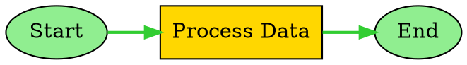

# Real-time Visualization and Highlights

SemanticKernel.Graph provides comprehensive real-time visualization capabilities with execution path highlighting, multi-format export support, and live execution overlays. This guide covers the complete visualization ecosystem including real-time highlighting, export formats, and execution monitoring.

## Overview

The real-time visualization system consists of several key components:

* **GraphVisualizationEngine**: Multi-format export engine for DOT, JSON, Mermaid, and SVG
* **GraphRealtimeHighlighter**: Live execution path tracking with visual highlights
* **Export Formats**: Professional-grade output for various visualization tools
* **Execution Overlays**: Real-time highlighting of current execution state
* **Customizable Themes**: Multiple visual themes and styling options

## Core Components

### GraphVisualizationEngine

The `GraphVisualizationEngine` is the central component for generating visualizations in multiple formats with advanced styling and customization options.

```csharp
public sealed class GraphVisualizationEngine : IDisposable
{
    /// <summary>
    /// Serializes the graph structure to DOT format for GraphViz rendering.
    /// </summary>
    public string SerializeToDot(GraphVisualizationData visualizationData, DotSerializationOptions? options = null);
    
    /// <summary>
    /// Serializes the graph structure to JSON format for API consumption.
    /// </summary>
    public string SerializeToJson(GraphVisualizationData visualizationData, JsonSerializationOptions? options = null);
    
    /// <summary>
    /// Generates an enhanced Mermaid diagram with advanced styling and features.
    /// </summary>
    public string GenerateEnhancedMermaidDiagram(GraphVisualizationData visualizationData, MermaidGenerationOptions? options = null);
}
```

**Key Features:**
* **Multi-format support**: DOT, JSON, Mermaid, and SVG export
* **Advanced styling**: Customizable themes and visual elements
* **Performance metrics**: Integration with execution metrics
* **Real-time updates**: Support for live execution highlighting
* **Professional output**: Production-ready visualization formats

**Usage Example:**
```csharp
// Create the engine with explicit options. In docs/examples a full runnable demo is available
// at `examples/GraphVisualizationExample.cs` which shows end-to-end usage.
var visualizationOptions = new GraphVisualizationOptions
{
    EnableRealtimeUpdates = true,
    IncludePerformanceMetrics = true,
    EnableAdvancedStyling = true
};

using var visualizationEngine = new GraphVisualizationEngine(visualizationOptions);

// Build a minimal graph: two function nodes connected by an edge
var fn1 = KernelFunctionFactory.CreateFromMethod(() => "node1-output", "Fn1");
var fn2 = KernelFunctionFactory.CreateFromMethod(() => "node2-output", "Fn2");

var node1 = new FunctionGraphNode(fn1, "node1", "Start");
var node2 = new FunctionGraphNode(fn2, "node2", "Process");

var nodes = new List<IGraphNode> { node1, node2 };
var edges = new List<GraphEdgeInfo> { new GraphEdgeInfo("node1", "node2", "on_success") };

var executionPath = new List<IGraphNode> { node1, node2 };
var visualizationData = new GraphVisualizationData(nodes, edges, currentNode: node2, executionPath: executionPath);

// Export to different formats (strings can be saved to files or returned from an API)
var dotGraph = visualizationEngine.SerializeToDot(visualizationData);
var jsonGraph = visualizationEngine.SerializeToJson(visualizationData);
var mermaidDiagram = visualizationEngine.GenerateEnhancedMermaidDiagram(visualizationData);
```

### GraphRealtimeHighlighter

The `GraphRealtimeHighlighter` provides live execution tracking with visual highlights, streaming updates, and customizable highlight styles.

```csharp
public sealed class GraphRealtimeHighlighter : IDisposable
{
    /// <summary>
    /// Starts highlighting for a graph execution.
    /// </summary>
    public void StartHighlighting(string executionId, GraphVisualizationData initialVisualizationData, ExecutionHighlightStyle? highlightStyle = null);
    
    /// <summary>
    /// Updates the current node being executed.
    /// </summary>
    public void UpdateCurrentNode(string executionId, IGraphNode currentNode, IReadOnlyList<IGraphNode> executionPath);
    
    /// <summary>
    /// Generates highlighted visualization in the specified format.
    /// </summary>
    public string GenerateHighlightedVisualization(string executionId, HighlightVisualizationFormat format);
}
```

**Key Features:**
* **Real-time tracking**: Live updates of execution progress
* **Visual highlights**: Customizable styles for current and completed nodes
* **Streaming support**: Web/mobile consumption ready
* **Performance optimized**: Batched updates for high-frequency executions
* **Multi-subscriber**: Support for multiple visualization consumers

**Usage Example:**
```csharp
// Create a highlighter that can accept events from your execution stream or be driven manually.
var highlightOptions = new GraphRealtimeHighlightOptions
{
    UpdateInterval = TimeSpan.FromMilliseconds(100),
    EnableAnimations = true
};

using var highlighter = new GraphRealtimeHighlighter(eventStream: null, options: highlightOptions);

// Start highlighting for a new execution using an existing GraphVisualizationData instance.
highlighter.StartHighlighting(executionId, visualizationData);

// Subscribe to events (handlers should be lightweight; offload heavy work)
highlighter.NodeExecutionStarted += (sender, e) =>
{
    // Log or push the update to a UI/WebSocket
    Console.WriteLine($"Node {e.Node.NodeId} started in execution {e.ExecutionId}");
};

highlighter.NodeExecutionCompleted += (sender, e) =>
{
    Console.WriteLine($"Node {e.Node.NodeId} completed in execution {e.ExecutionId} (success={e.Success})");
};

// Manually update current node and path during execution
highlighter.UpdateCurrentNode(executionId, currentNode, executionPath);

// Produce a highlighted Mermaid diagram for embedding in documentation or UI
var highlightedMermaid = highlighter.GenerateHighlightedVisualization(executionId, HighlightVisualizationFormat.Mermaid);
```

## Export Formats

### DOT Format (GraphViz)

Professional-grade graph visualization format for GraphViz rendering with advanced layout options.

```csharp
var dotOptions = new DotSerializationOptions
{
    GraphName = "My Workflow",
    LayoutDirection = DotLayoutDirection.LeftToRight,
    EnableClustering = true,
    HighlightExecutionPath = true,
    HighlightCurrentNode = true,
    IncludeNodeTypeInfo = true
};

var dotGraph = visualizationEngine.SerializeToDot(visualizationData, dotOptions);
```

**DOT Format Features:**
* **Layout control**: Top-to-bottom, left-to-right, and other directions
* **Node clustering**: Automatic grouping of related nodes
* **Custom styling**: User-defined node and edge styles
* **Execution highlighting**: Visual emphasis on execution path
* **Professional output**: Industry-standard GraphViz format

**Generated DOT Example:**


### JSON Format

Structured data format for API consumption, data exchange, and programmatic visualization.

```csharp
var jsonOptions = new JsonSerializationOptions
{
    Indented = true,
    UseCamelCase = true,
    IncludeNodeProperties = true,
    IncludeLayoutInfo = true,
    IncludeExecutionMetrics = true,
    IncludeTimestamps = true
};

var jsonGraph = visualizationEngine.SerializeToJson(visualizationData, jsonOptions);
```

**JSON Format Features:**
* **Structured data**: Hierarchical representation of graph structure
* **Metadata inclusion**: Timestamps, execution metrics, and layout information
* **API ready**: Optimized for web and mobile consumption
* **Extensible**: Easy to extend with custom properties
* **Performance**: Efficient serialization for large graphs

**Generated JSON Example:**
```json
{
  "metadata": {
    "generatedAt": "2025-08-15T10:30:00Z",
    "nodeCount": 3,
    "edgeCount": 2,
    "hasExecutionPath": true
  },
  "nodes": [
    {
      "nodeId": "start",
      "name": "Start",
      "type": "FunctionGraphNode",
      "position": { "x": 100, "y": 200 }
    }
  ],
  "edges": [
    {
      "sourceId": "start",
      "targetId": "process",
      "condition": null
    }
  ],
  "executionPath": ["start", "process"],
  "currentNode": "process"
}
```

### Mermaid Format

Web-friendly diagram format with enhanced styling and real-time highlighting support.

```csharp
var mermaidOptions = new MermaidGenerationOptions
{
    Direction = "TB", // Top to bottom
    IncludeTitle = true,
    EnableStyling = true,
    StyleByNodeType = true,
    HighlightExecutionPath = true,
    HighlightCurrentNode = true,
    Theme = MermaidTheme.Default
};

var mermaidDiagram = visualizationEngine.GenerateEnhancedMermaidDiagram(visualizationData, mermaidOptions);
```

**Mermaid Format Features:**
* **Web integration**: Native support in Markdown and documentation
* **Enhanced styling**: Custom themes and visual customization
* **Real-time highlights**: Live execution path emphasis
* **Accessibility**: High contrast and professional themes
* **Interactive**: Support for click events and tooltips

**Generated Mermaid Example:**
```mermaid
graph TB
    %% Graph generated at 2025-08-15 10:30:00
    
    start((Start))
    process[Process Data]
    end((End))
    
    start --> process
    process --> end
    
    %% Real-time highlight styles
    classDef currentNode fill:#FFD700,stroke:#FF6347,stroke-width:3
    classDef completedNode fill:#90EE90,stroke:#228B22,stroke-width:2
    classDef executionPath stroke:#32CD32,stroke-width:2
    
    class process currentNode
    class start completedNode
    class start,process executionPath
```

### SVG Format

Vector graphics format with customizable styling and real-time execution overlays.

```csharp
var svgOptions = new SvgSerializationOptions
{
    Width = 1200,
    Height = 800,
    HorizontalSpacing = 200,
    VerticalSpacing = 150,
    IncludeMetricsOverlay = true,
    HighlightExecutionPath = true,
    HighlightCurrentNode = true
};

var svgGraph = visualizationEngine.SerializeToSvg(visualizationData, svgOptions);
```

**SVG Format Features:**
* **Vector graphics**: Scalable without quality loss
* **Customizable dimensions**: Configurable canvas size and spacing
* **Metrics overlay**: Built-in performance indicators
* **Execution highlighting**: Real-time path and node emphasis
* **Web integration**: Native browser support

## Real-time Execution Overlays

### Execution Highlighting

Real-time highlighting provides live visual feedback during graph execution.

```csharp
// Configure highlight styles
var highlightStyle = new ExecutionHighlightStyle
{
    CurrentNodeStyle = new NodeHighlightStyle
    {
        FillColor = "#FFD700",      // Gold
        StrokeColor = "#FF6347",    // Tomato
        StrokeWidth = 3
    },
    CompletedNodeStyle = new NodeHighlightStyle
    {
        FillColor = "#90EE90",      // Light green
        StrokeColor = "#228B22",    // Forest green
        StrokeWidth = 2
    },
    FailedNodeStyle = new NodeHighlightStyle
    {
        FillColor = "#FFB6C1",      // Light pink
        StrokeColor = "#DC143C",    // Crimson
        StrokeWidth = 2
    },
    ExecutionPathStyle = new EdgeHighlightStyle
    {
        StrokeColor = "#32CD32",    // Lime green
        StrokeWidth = 2
    }
};

// Start highlighting with custom style
highlighter.StartHighlighting(executionId, visualizationData, highlightStyle);
```

### Live Updates

The highlighter provides real-time updates through events and streaming.

```csharp
// Subscribe to highlight events
highlighter.NodeExecutionStarted += (sender, e) =>
{
    Console.WriteLine($"Node {e.Node.Name} started execution");
};

highlighter.NodeExecutionCompleted += (sender, e) =>
{
    Console.WriteLine($"Node {e.Node.Name} completed execution");
};

highlighter.ExecutionPathUpdated += (sender, e) =>
{
    Console.WriteLine($"Execution path updated: {e.ExecutionPath.Count} nodes");
};

// Update execution state
highlighter.UpdateCurrentNode(executionId, currentNode, executionPath);
highlighter.UpdateExecutionPath(executionId, newExecutionPath);
```

### Performance Monitoring

Integration with performance metrics for comprehensive execution monitoring.

```csharp
// Add node completion with performance data
highlighter.AddNodeCompletionHighlight(
    executionId,
    completedNode,
    success: true,
    executionTime: TimeSpan.FromMilliseconds(150)
);

// Generate performance-enhanced visualization
var performanceData = new
{
    executionId,
    totalNodes = executionPath.Count,
    completedNodes = completedNodes.Count,
    averageExecutionTime = completedNodes.Values.Average(n => n.ExecutionTime.TotalMilliseconds),
    successRate = completedNodes.Values.Count(n => n.Success) / (double)completedNodes.Count
};
```

## Configuration Options

### GraphVisualizationOptions

Global configuration for the visualization engine.

```csharp
var visualizationOptions = new GraphVisualizationOptions
{
    Theme = VisualizationTheme.Professional,
    EnableRealtimeUpdates = true,
    EnableCaching = true,
    MaxCacheSize = 200,
    CacheExpirationMinutes = 60,
    IncludePerformanceMetrics = true,
    MaxNodesPerVisualization = 2000,
    EnableAdvancedStyling = true
};
```

### GraphRealtimeHighlightOptions

Configuration for real-time highlighting behavior.

```csharp
var highlightOptions = new GraphRealtimeHighlightOptions
{
    UpdateInterval = TimeSpan.FromMilliseconds(50),
    EnableImmediateUpdates = false,
    MaxHistorySnapshots = 2000,
    EnableAnimations = true,
    MaxConcurrentExecutions = 100,
    DefaultHighlightStyle = new ExecutionHighlightStyle()
};
```

## Advanced Features

### Custom Themes

Create custom visual themes for different use cases.

```csharp
// Professional theme for business presentations
var professionalTheme = new VisualizationTheme
{
    PrimaryColor = "#2E86AB",
    SecondaryColor = "#A23B72",
    BackgroundColor = "#F8F9FA",
    TextColor = "#212529",
    AccentColor = "#F7931E"
};

// High contrast theme for accessibility
var highContrastTheme = new VisualizationTheme
{
    PrimaryColor = "#000000",
    SecondaryColor = "#FFFFFF",
    BackgroundColor = "#FFFFFF",
    TextColor = "#000000",
    AccentColor = "#FF0000"
};
```

### Node Type Styling

Automatic styling based on node types and execution state.

```csharp
var mermaidOptions = new MermaidGenerationOptions
{
    StyleByNodeType = true,
    CustomNodeStyles = new Dictionary<string, string>
    {
        ["FunctionGraphNode"] = "fill:#E3F2FD,stroke:#1976D2",
        ["ConditionalGraphNode"] = "fill:#FFF3E0,stroke:#F57C00",
        ["ReActLoopGraphNode"] = "fill:#F3E5F5,stroke:#7B1FA2"
    }
};
```

### Export Pipeline

Automated export pipeline for multiple formats.

```csharp
public async Task ExportAllFormatsAsync(GraphVisualizationData data, string baseFileName)
{
    var tasks = new List<Task>();
    
    // Export to DOT
    tasks.Add(File.WriteAllTextAsync($"{baseFileName}.dot", 
        visualizationEngine.SerializeToDot(data)));
    
    // Export to JSON
    tasks.Add(File.WriteAllTextAsync($"{baseFileName}.json", 
        visualizationEngine.SerializeToJson(data)));
    
    // Export to Mermaid
    tasks.Add(File.WriteAllTextAsync($"{baseFileName}.mermaid", 
        visualizationEngine.GenerateEnhancedMermaidDiagram(data)));
    
    // Export to SVG
    tasks.Add(File.WriteAllTextAsync($"{baseFileName}.svg", 
        visualizationEngine.SerializeToSvg(data)));
    
    await Task.WhenAll(tasks);
}
```

## Integration Patterns

### Web Application Integration

Integrate real-time visualization with web applications.

```csharp
// WebSocket endpoint for real-time updates
app.MapHub<VisualizationHub>("/visualization");

// REST API for static exports
app.MapGet("/api/visualization/{executionId}/dot", (string executionId) =>
{
    var visualizationData = GetVisualizationData(executionId);
    return visualizationEngine.SerializeToDot(visualizationData);
});

app.MapGet("/api/visualization/{executionId}/mermaid", (string executionId) =>
{
    var visualizationData = GetVisualizationData(executionId);
    return visualizationEngine.GenerateEnhancedMermaidDiagram(visualizationData);
});
```

### Documentation Generation

Automated documentation with embedded visualizations.

```csharp
var documentationGenerator = new GraphDocumentationGenerator(
    new GraphDocumentationOptions
    {
        IncludeMermaidDiagram = true,
        IncludeJsonGraph = true,
        IncludeDotGraph = true,
        IncludePerformanceAnalysis = true
    }
);

var documentation = documentationGenerator.GenerateDocumentation(visualizationData);
await File.WriteAllTextAsync("graph_documentation.md", documentation);
```

### Monitoring Dashboard

Real-time monitoring dashboard with live updates.

```csharp
// Create monitoring dashboard
var dashboard = new VisualizationDashboard(
    visualizationEngine,
    realtimeHighlighter,
    performanceMetrics
);

// Subscribe to execution events
dashboard.ExecutionStarted += (sender, e) =>
{
    // Update dashboard with new execution
    dashboard.AddExecution(e.ExecutionId, e.VisualizationData);
};

dashboard.ExecutionUpdated += (sender, e) =>
{
    // Refresh dashboard with current state
    dashboard.UpdateExecution(e.ExecutionId, e.HighlightState);
};
```

## Best Practices

### Performance Optimization

1. **Enable caching**: Use visualization caching for repeated exports
2. **Batch updates**: Configure appropriate update intervals for real-time highlighting
3. **Limit node count**: Set reasonable limits for large graphs
4. **Async operations**: Use async export methods for large visualizations

### Visual Design

1. **Consistent themes**: Use consistent color schemes across visualizations
2. **Accessibility**: Provide high contrast themes for better visibility
3. **Professional appearance**: Use professional themes for business presentations
4. **Custom styling**: Leverage custom node and edge styles for clarity

### Real-time Updates

1. **Update frequency**: Balance update frequency with performance
2. **Event handling**: Properly handle and dispose of event subscriptions
3. **Error handling**: Implement robust error handling for visualization failures
4. **Resource management**: Dispose of visualization components properly

## Troubleshooting

### Common Issues

**Visualization Not Updating**
* Check if real-time updates are enabled
* Verify event stream connectivity
* Ensure proper disposal of components

**Export Format Issues**
* Validate input data structure
* Check format-specific options
* Verify file permissions for export

**Performance Problems**
* Reduce update frequency
* Enable caching
* Limit concurrent visualizations

### Debug Tips

1. **Enable detailed logging**: Set log level to Debug for visualization details
2. **Check event subscriptions**: Verify event handlers are properly connected
3. **Monitor resource usage**: Track memory and CPU usage during visualization
4. **Test with small graphs**: Start with simple graphs to verify functionality

## Concepts and Techniques

**Real-time Visualization**: Live updating of graph visualizations during execution with current state highlighting.

**Execution Overlays**: Visual emphasis on execution path, current node, and completion status in real-time.

**Multi-format Export**: Support for multiple visualization formats (DOT, JSON, Mermaid, SVG) for different use cases.

**Highlight Styling**: Customizable visual styles for different execution states and node types.

**Streaming Updates**: Real-time data flow for live visualization updates across multiple consumers.

## See Also

* [Debug and Inspection](debug-and-inspection.md) - Debug visualization and inspection capabilities
* [Graph Inspection API](graph-inspection-api.md) - Runtime graph inspection and monitoring
* [Performance Metrics](metrics-and-observability.md) - Integration with performance monitoring
* [Streaming Execution](streaming-execution.md) - Real-time execution event streaming
